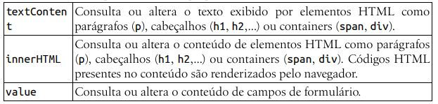
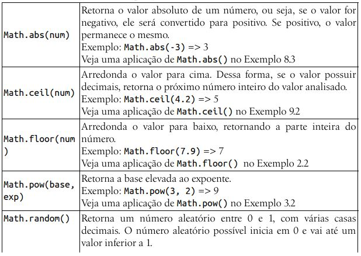
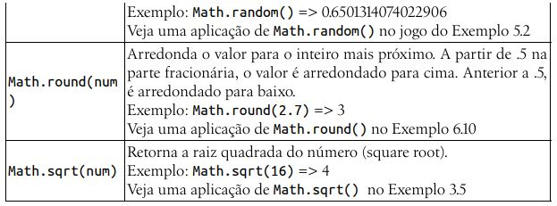

# Capítulo 2 - Integração com HTML

O evento mais comum de ser programado é o clique no botão. Mas há diversos outros, como modificar o conteúdo de um campo, enviar os dados de um formulário, sair de um campo, carregar a página, entre outros.

Para criar um evento e definir qual a função acionada quando esse evento ocorrer, deve-se utilizar uma palavra reservada para indicar para qual evento a linguagem ficará "na escuta", seguido do nome da função a ser acionada. A palavra reservda pode ser, por exemplo, (on)click, (on)change, (on)submit, (on)blur ou (on)load. O uso do "on" para preceder o evento vai depender da forma a ser utilizada para criar o link entre o HTML e o JavaScript.

Já as funções JavaScript são declaradas a partir da palavra-chave function seguida do nome da função e dos parênteses ( ). Uma função contém um conjunto de comandos que realizam uma ação.

Os comandos que pertencem a uma função devem estar delimitados pelas chaves { }. A função que obtém o conteúdo do campo nome de um formulário e a exibe precedida pela palavra “Olá” em um parágrafo com id="resposta" é a seguinte:

    function mostrarOla() {
        var nome = document.getElementById("nome").value;
        document.getElementById("resposta").textContent = "Olá " + nome;
    }

Como uma função executa um conjunto de ações, é uma boa prática de programação dar um nome para a função começando por um verbo. O uso do camelcase (com letras maiúsculas no meio do nome para indicar uma nova palavra) é também um padrão recomendado e facilita a compreensão da leitura do nome.

### Método getElementById()

Para referenciar um elemento HTML identificado no documento, deve-se utilizar o método getElementById(). Esse método permite referenciar qualquer elemento da página, como um campo de formulário, um parágrafo, um botão, uma imagem, ente outros. Para que um elemento HTML seja referenciado, ele precisa conter um atributo id.

Podemos armazenar a referência a um elemento em uma variável e depois obter a sua propriedade, como no exemplo a seguir:

    var inputNome = document.getElementById("nome");
    var nome = inputNome.value;

Ou, então, utilizar um único comando, acessando diretamente a propriedade que queremos obter ou alterar, como a seguir.

    var nome = document.getElementById("nome").value;

Alguns termos resumidos:

- Objeto – representa uma instância de uma classe.
- Método – representa uma instrução ou um conjunto de instruções que executam uma tarefa.
- Propriedade – representa uma característica (atributo) de um objeto.

Comandos:

- getElementById("nome do id"): Esse comando serve para buscar no documento algum id e referencia-lo no javascript.

- .value: Serve para pegar o conteúdo que está na tag do id, por exemplo, saber o conteúdo que está escrito em um campo de formulário.

- .textContent: Ele altera o valor que esta em algum campo, por exemplo, mudar o texto de um <h3></h3>.

Há também a propriedade <b>innerHTML</b>, semelhante a textContent quanto aos elementos em que atua, porém renderiza os códigos HTML existentes no seu conteúdo.

A propriedade innerHTML pode apresentar algum risco relacionado à segurança na construção de páginas web em um tipo de ataque denominado XSS (Cross-Site Scripting). Essa vulnerabilidade explora a exibição de dados contendo códigos que poderiam ser enviados por usuários maliciosos. Para evitar esse problema, é necessário filtrar os dados de entrada de um site.

Exemplo:

    function mostrarOla() {
        var nome = document.getElementById("nome").value;
        document.getElementById("resposta").innerHTML = "Olá " + nome;
    }

    var mostrar = document.getElementById("mostrar");
    mostrar.onclick = mostrarOla;

Essa abordagem é conhecida como rotina de tratamento de eventos DOM. A DOM (Document Object Model) permite acessar cada elemento de uma página HTML como uma estrutura hierárquica – semelhante à árvore genealógica de uma família.

### Uso dos listeners (ouvintes) de eventos

A abordagem recomendada para vincular um arquivo .js ao documento HTML é a utilização dos chamados listeners (ouvintes) de eventos ou modelos de eventos DOM nível 2. Nesse modelo, é possível registrar múltiplas funções para um mesmo elemento HTML em um mesmo evento.

Para criar um listener, deve-se utilizar o método addEventListener, cuja sintaxe é:

    elemento.addEventListener('evento', função);

Exemplo:

    // declara a função mostrarOla
    function mostrarOla() {
        // obtém o conteúdo do campo (com id=) nome
        var nome = document.getElementById("nome").value;

        // exibe no parágrafo (resposta): "Olá " e o nome informado
        document.getElementById("resposta").textContent = "Olá " + nome;
    }

    // cria uma referência ao botão (com id=) mostrar
    var mostrar = document.getElementById("mostrar");

    // registra para o botão "mostrar" um ouvinte para o evento click,
    // que ao ser clicado irá chamar a função mostrarOla
    mostrar.addEventListener("click", mostrarOla);

###  Nomenclatura e escopo das variáveis

É importante usar alguns padrões nos nomes das variáveis para que não fique confuso na hora de intepretar o código.

Devemos utilizar algumas letras antes de cada nome de variável para facilitar, são elas:

- in (input) para os campos de entrada de texto;
- bt (button) para os botões;
- out (output) para os locais de saída de dados.

Outro detalhe importante sobre as variáveis é que elas têm um “escopo” de abrangência (de validade no programa). As variáveis declaradas dentro de uma função são denominadas variáveis locais e, como o nome sugere, só têm validade nesse local (nessa função). Já as variáveis declaradas fora das funções são consideradas variáveis globais, e valem para todo o programa. Sempre que possível, dê preferência por utilizar variáveis locais, pois o espaço alocado por uma variável local é liberado após a conclusão da função. Além disso, diversos outros problemas podem ser evitados, como redefinir na função o valor de uma variável global já existente.

Um cuidado com relação à declaração das variáveis JavaScript: não se esqueça de utilizar a palavra var antes do nome da variável. Declarar variáveis sem a palavra var faz com que ela seja entendida como uma variável global, mesmo se declarada dentro de uma função. As boas práticas de programação recomendam o uso do var antes do nome da variável, e devemos seguir essa recomendação.

###  Operadores aritméticos e funções matemáticas

Além dos tradicionais operadores de adição(+), subtração(-), multiplicação(*), divisão (/) e exponenciação (**), as linguagens de programação dispõe também do operador módulo (%). O módulo é utilizado para obter o resto da divisão entre dois números. Observe as seguintes expressões matemáticas:

    var a = 5 % 2; // a = 1
    var b = 7 % 4; // b = 3

Outros cálculos como raiz quadrada, seno e cosseno podem ser obtidos em JavaScript com o uso das funções matemáticas da classe Math.

Para realizar pequenos testes e verificar o resultado de fórmulas que utilizam operadores aritméticos de diferentes níveis de hierarquia, pode-se recorrer editor e utilizar o método alert().

    var x = 10 / 2 * Math.sqrt(9) - 4;
    alert(x);

Exemplo:

<b>a)</b> Elaborar um programa para uma Vídeo Locadora, que leia o título e a duração de um filme em minutos. Exiba o título do filme e converta a duração para horas e minutos.

Código HTML:

    <body>
        <h1>Vídeo Locadora JS</h1>
        

        
        
 Título do Filme:
            <input type="text" id="inTitulo">
        

        
 Duração (min):
            <input type="text" id="inDuracao">
        

        

            <input type="button" value="Converter em Horas e Minutos" id="btConverter">
        

        

        

    </body>

Código JS:

    function converterDuracao() {
        // cria referência aos elementos da página
        var inTitulo = document.getElementById("inTitulo");
        var inDuracao = document.getElementById("inDuracao");

        var outTitulo = document.getElementById("outTitulo");
        var outResposta = document.getElementById("outResposta")

        // obtém conteúdos dos campos de entrada
        var titulo = inTitulo.value;
        var duracao = Number(inDuracao.value);

        // arredonda para baixo o resultado da divisão
        var horas = Math.floor(duracao / 60);

        // obtém o resto da divisão entre os números
        var minutos = duracao % 60;

        // altera o conteúdo dos parágrafos de resposta
        outTitulo.textContent = titulo;
        outResposta.textContent = horas + " hora(s) e " + minutos + " minuto(s)";
    }

    // cria uma referência ao elemento btConverter (botão)
    var btConverter = document.getElementById("btConverter");
    // registra um evento associado ao botão, para carregar uma função
    btConverter.addEventListener("click", converterDuracao);

<b>b)</b> Elaborar um programa para uma revenda de veículos. O programa deve ler modelo e preço do veículo. Apresentar como resposta o valor da entrada (50%) e o saldo em 12x.

Código HTML:

    <h1>Revenda de Veículos JS</h1>

    
 
    Veículo:
        <input type="text" id="inVeiculo">
    

    
 
    Preço R$:
        <input type="text" id="inPreco">
    

    
 
        <input type="button" value="Ver Promoção" id="btVerPromocao">
    

    <h3 id="outVeiculo"></h3>
    <h3 id="outEntrada"></h3>
    <h3 id="outParcela"></h3>

Código JS:

    function mostrarPromocao() {
        // cria referência aos elementos manipulados pelo programa
        var inVeiculo = document.getElementById("inVeiculo");
        var inPreco = document.getElementById("inPreco");

        var outVeiculo = document.getElementById("outVeiculo");
        var outEntrada = document.getElementById("outEntrada");
        var outParcela = document.getElementById("outParcela");

        // obtém conteúdo dos campos de entrada
        var veiculo = inVeiculo.value;
        var preco = Number(inPreco.value);

        // calcula valor da entrada e das parcelas
        var entrada = preco * 0.50;
        var parcela = (preco * 0.50) / 12;

        // altera o conteúdo dos parágrafos de resposta
        outVeiculo.textContent = "Promoção: " + veiculo;
        outEntrada.textContent = "Entrada de R$: " + entrada.toFixed(2);
        outParcela.textContent = "+ 12x de R$: " + parcela.toFixed(2);
    }

    // cria uma referência ao elemento btVerPromocao (botão)
    var btVerPromocao = document.getElementById("btVerPromocao");
    // registra um evento associado ao botão, para carregar uma função
    btVerPromocao.addEventListener("click", mostrarPromocao);

<b>c)</b> Elaborar um programa para um restaurante que leia o preço por kg e o consumo (em gramas) de um cliente. Exiba o valor a ser pago.

Código HTML:

    <h1>Restaurante JS</h1>

    
Buffet por Quilo R$:
        <input type="text" id="inQuilo">
    

    
Consumo do Cliente (gr):
        <input type="text" id="inConsumo">
    

    

        <input type="button" value="Calcular Preço" id="btCalcular">
    

    <h3 id="outValor"></h3>

Código JS:

    function calcularPreco() {
    // cria referência aos elementos da página
    var inQuilo = document.getElementById("inQuilo");
    var inConsumo = document.getElementById("inConsumo");
    var outValor = document.getElementById("outValor");

    // obtém conteúdo dos campos de entrada
    var quilo = Number(inQuilo.value);
    var consumo = Number(inConsumo.value);

    // calcula valor a ser pago
    var valor = (quilo / 1000) * consumo;

    // altera o conteúdo da linha de resposta
    outValor.textContent = "Valor a pagar R$: " + valor.toFixed(2);

    }

    // cria referência ao elemento btCalcular
    var btCalcular = document.getElementById("btCalcular");
    // registra um evento associado ao botão, para carregar uma função
    btCalcular.addEventListener("click", calcularPreco);

Exercícios:

<b>a)</b> Umafarmáciaestácom uma promoção – Na compra de duas unidades de um mesmo medicamento, o cliente recebe como desconto os centavos do valor total. Elaborar um programa que leia descrição e preço de um medicamento. Informe o valor do produto na promoção.

<b>b)</b> Elaborar um programa para uma lan house de um aeroporto – O programa deve ler o valor de cada 15 minutos de uso de um computador e o tempo de uso por um cliente em minutos. Informe o valor a ser pago pelo cliente, sabendo que as frações extras de 15 minutos devem ser cobradas de forma integral.

<b>c)</b> Um supermercado está com uma promoção – Para aumentar suas vendas no setor de higiene, cada etiqueta de produto deve exibir uma mensagem anunciando 50% de desconto (para um item) na compra de três unidades do produto. Elaborar um programa que leia descrição e preço de um produto. Após, apresente as mensagens indicando a promoção.

