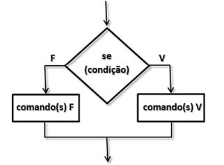
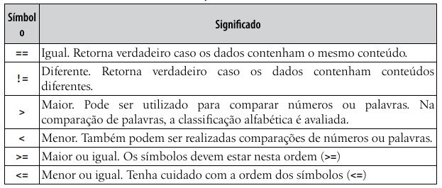
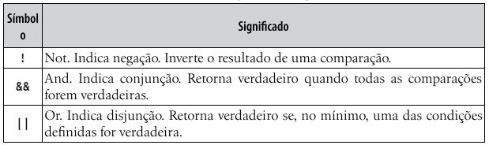
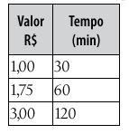

# Capitulo 3 - Condições

Os comandos if...else e switch...case são os responsáveis por criar condições em JavaScript (e na maioria das linguagens).

### If... else

Uma das representações tradicionalmente utilizadas para o ensino de Algoritmos e Lógica de Programação são os fluxogramas. Eles são úteis para facilitar a compreensão do fluxo dos comandos em uma estrutura de controle.

Para criar essa estrutura clássica, utilizamos os comandos if... else (se... senão). Eles possuem algumas variações. É possível utilizar apenas o if (para apresentar uma mensagem caso o cliente seja menor de idade, por exemplo). E também criar vários comandos else (para verificar a classificação etária de uma aluno de natação, que poderia ser infantil, juvenil ou adulto).

Exemplos da sintaxe do comando if:

    // define uma condição simples
    if (condição) {
        comandos;
    }

    // define uma condição de if... else
    if (condição) {
        comandos V;
    } else {
        comandos F;
    }

    // define múltiplas condições
    if (condição 1) {
        comandos 1;
    } else if (condição 2) {
        comandos 2;
    } else {
        comandos 3;
    }

### Operadores relacionais

Para definir as condições utilizadas nas estruturas condicionais, deve-se fazer uso de operadores relacionais. Quando inseridas em um programa, cada comparação deve retornar true (verdadeiro) ou false (falso).

Existem ainda os símbolos de === (estritamente igual) e !== (estritamente diferente). Eles comparam também o tipo do dado em análise. Assim, '5' === 5 retorna falso; e '5' !== 5 retorna verdadeiro.

Lembrando que nesse caso o '5'(entre aspas) é uma string enquanto o 5 (sem aspas) é um valor numérico, e quando se usa o estritamente igual ou estritamente diferente ele consegue diferenciar esses tipos por exemplo.

A página faz a leitura do nome e das notas de um aluno, apresenta a média e uma mensagem para o aluno: “Parabéns ... Você foi aprovado(a)!” ou, então, “Ops... Você foi reprovado(a).”. A situação de aprovado ou reprovado é definida pela média das notas, que deve ser 7.0 ou superior para aprovação. Caso a nota seja inferior a 7.0, a mensagem indicando a reprovação deve ser exibida. Também faremos nesse exemplo a aplicação de um estilo na mensagem que indica a siuação do aluno.

Código HTML:

    <h1>Programa Situação do Aluno</h1>

    

        Nome do Aluno:
        <input type="text" id="inNome">
    

    

        1ª Nota:
        <input type="text" id="inNota1">
    

    

        2ª Nota:
        <input type="text" id="inNota2">
    

    

        <input type="button" value="Exibir Média e Situação" id="btResultado">
    

    <h3 id="outMedia"></h3>
    <h3 id="outSituacao"></h3>

Código JS:

    function calcularMedia() {
        // cria referência aos elementos da página
        var inNome = document.getElementById("inNome");
        var inNota1 = document.getElementById("inNota1");
        var inNota2 = document.getElementById("inNota2");

        var outSituacao = document.getElementById("outSituacao");
        var outMedia = document.getElementById("outMedia");

        // obtém os conteúdos dos campos de edição da página
        var nome = inNome.value;
        var nota1 = Number(inNota1.value);
        var nota2 = Number(inNota2.value);

        // calcula a média das notas
        var media = (nota1 + nota2) / 2;

        // apresenta a média (altera o conteúdo do elemento outMedia)
        outMedia.textContent = "Média das Notas: " + media.toFixed(1);

        // cria a condição
        if (media >= 7) {
            // altera o texto e estilo da cor do elemento outSituacao
            outSituacao.textContent = "Parabéns " + nome + "! Você foi aprovado(a)";
            outSituacao.style.color = "blue";
        } else {
            outSituacao.textContent = "Ops " + nome + "... Você foi reprovado(a)";
            outSituacao.style.color = "red";
        }
    }

    // cria uma referência ao elemento btResultado (botão)
    var btResultado = document.getElementById("btResultado");
    // registra um evento associado ao botão, para carregar uma função
    btResultado.addEventListener("click", calcularMedia);

### Operadores lógicos

Para definir mais de uma condição em um programa, devemos utilizar operadores lógicos.

Basicamnete quando quisermos que duas ou mais condições sejam verdadeiras para prosseguir com o código devemos utilizar o and &&.
Caso precise que uma ou outra condição seja verdadeira para a continuação do código utilizamos o OR ||.
E se por algum motivo quisermos alterar o valor da condição utilizamos o Not !. Basicamente o que é verdadeiro vira falso e falso vira verdadeiro.

Exemplo:

O programa vai calcular o peso ideal de uma pessoa. Para isso, foram pesquisados alguns sites sobre o assunto. Em um deles, há a indicação de que o peso ideal de um adulto pode ser calculado a partir das fórmulas: 22 * altura 2 (para homens); e 21 * altura 2 (para mulheres).

Código HTML:

    <h1>Programa Cálculo do Peso Ideal</h1>

    

    Nome:
        <input type="text" id="inNome">
    

    

    Sexo:
        <input type="radio" name="sexo" id="rbMasculino"> Masculino
        <input type="radio" name="sexo" id="rbFeminino"> Feminino
    

    

    Altura:
        <input type="text" id="inAltura">
    

    

        <input type="button" value="Calcular Peso Ideal" id="btCalcular">
        <input type="button" value="Limpar Campos" id="btLimpar">
    

    <h3 id="outResposta"></h3>

Código JS:

    function calcularPeso() {
        // cria referência aos elementos manipulados pela function
        var inNome = document.getElementById("inNome");

        var rbMasculino = document.getElementById("rbMasculino");
        var rbFeminino = document.getElementById("rbFeminino");

        var inAltura = document.getElementById("inAltura");

        var outResposta = document.getElementById("outResposta");

        // obtém o conteúdo dos campos de edição da página
        var nome = inNome.value;
        var masculino = rbMasculino.checked;
        var feminino = rbFeminino.checked;
        var altura = Number(inAltura.value);

        // verifica se nome foi preenchido e sexo selecionado
        if (nome == "" || (masculino == false && feminino == false)) {
            alert("Por favor, informe o nome e selecione o sexo...");
            inNome.focus(); // posiciona (joga o foco) no campo de edição inNome
            return;
        }

        // se altura vazio (0) ou NaN: Not-a-Number (um texto for informado, por exemplo)
        if (altura == 0 || isNaN(altura)) {
            alert("Por favor, informe a altura corretamente...");
            inAltura.focus();
            return;
        }

        // se masculino (significa se masculino == true)
        if (masculino) {
            var peso = 22 * Math.pow(altura, 2); // Math.pow eleva ao quadrado
        } else {
            var peso = 21 * Math.pow(altura, 2);
        }

        // apresenta a resposta (altera o conteúdo da linha outResposta)
        outResposta.textContent = nome + ": Seu peso ideal é " +
        peso.toFixed(3) + " kg";
    }
    // cria referência ao elemento btCalcular e registra evento associado a calcularPeso
    var btResultado = document.getElementById("btCalcular");
    btCalcular.addEventListener("click", calcularPeso);

    function limparCampos() {
        // Limpa os conteúdos dos elementos
        document.getElementById("inNome").value = "";
        document.getElementById("rbMasculino").checked = false;
        document.getElementById("rbFeminino").checked = false;
        document.getElementById("inAltura").value = "";
        document.getElementById("outResposta").textContent = "";

        // posiciona (joga o foco) no elemento inNome
        document.getElementById("inNome").focus();
    }

    var btLimpar = document.getElementById("btLimpar");
    btLimpar.addEventListener("click", limparCampos);

Nesse exemplo utilizamos uma função apenas para limpar os campos, mas podemos também adicionar uma função para recarregar a página e consequentemente limpar os campos. Sendo assim, ficaria:

    function limparCampos() {

        // recarrega a página
        location.reload();
        
        // posiciona (joga o foco) no elemento inNome
        document.getElementById("inNome").focus();
    }

    var btLimpar = document.getElementById("btLimpar");
    btLimpar.addEventListener("click", limparCampos);

###  Switch...Case

As linguagens de programação dispõem de outra estrutura que permite criar condições. Trata-se do comando switch... case. Ele é útil quando tivermos várias alternativas definidas a partir do conteúdo de uma variável.

Exemplo:

    var bairro = prompt("Bairro de Entrega: ");
    var taxaEntrega;

    switch (bairro) {
        case "Centro":
            taxaEntrega = 5.00;
            break;

        case "Fragata":
        case "Três Vendas":
            taxaEntrega = 7.00;
            break;

        case "Laranjal":
            taxaEntrega = 10.00;
            break;

        default:
            taxaEntrega = 8.00;
    }

    alert("Taxa R$: " + taxaEntrega.toFixed(2));

###  Operador ternário

Existe ainda uma forma abreviada para criar as instruções if.. else conhecida como operador ternário (três operandos) ou operador condicional. Ele consiste em realizar uma atribuição para uma variável com base na análise de uma condição. Exemplo:

    var categoria = idade >= 18 ? "Adulto" : "Juvenil";

----------------------------------------------------

    if (idade >= 18) {
        var categoria = "Adulto";
    } else {
        var categoria = "Juvenil";
    }

Ambos os códigos representam a mesma coisa, as vezes quando precisamos de alguma condição simples para determinada variável podemos utilizar ela na forma reduzida para deixar o programa mais "limpo".

### Exemplos

<b>a)</b> Sabendo que o fuso horário da França em relação ao Brasil é de + 5 horas (no horário de verão na França), elaborar um programa que leia a hora no Brasil e informe a hora na França.

Código HTML:

    <h1>Programa Fuso Horário</h1>

    

    Hora no Brasil (h.m):
        <input type="text" id="inHoraBrasil">
    

    

        <input type="button" value="Exibir Hora na França" id="btExibir">
    

    <h3 id="outHoraFranca"></h3>

Código JS:

    function calcularFuso() {
        // cria uma referência aos elementos da página
        var inHoraBrasil = document.getElementById("inHoraBrasil");
        var outHoraFranca = document.getElementById("outHoraFranca");

        // obtém e converte o conteúdo do campo inHoraBrasil
        var horaBrasil = Number(inHoraBrasil.value);

        // se não preencheu ou Not-a-Number (NaN)
            if (inHoraBrasil.value == "" || isNaN(horaBrasil)) {
            alert("Informe a hora no Brasil corretamente"); // exibe alerta
            inHoraBrasil.focus(); // posiciona em inHoraBrasil
            return;
        }

        var horaFranca = horaBrasil + 5; // calcula o horário na França

        // se passar das 24 horas na Franca ...
        if (horaFranca > 24) {
            horaFranca = horaFranca - 24; // ... subtrai 24
        }

        // exibe resposta (altera conteúdo do elemento outHoraFranca)
        outHoraFranca.textContent = "Hora na França: " + horaFranca.toFixed(2);
    }

    // cria uma referência ao elemento btExibir e registra evento associado a function
    var btExibir = document.getElementById("btExibir");
    btExibir.addEventListener("click", calcularFuso);

<b>b)</b> Elaborar um programa que leia um número e calcule sua raiz quadrada. Caso a raiz seja exata (quadrados perfeitos), informá-la, caso contrário, informe: ‘Não há raiz exata para ..’.

Código HTML:

    <h1>Programa Raiz Quadrada</h1>

    

        Número:
        <input type="text" id="inNumero">
    

    

        <input type="button" value="Exibir Raiz Quadrada" id="btExibir">
    

    <h3 id="outResposta"></h3>

Código JS:

    function calcularRaiz() {
        // cria uma referência aos elementos da página
        var inNumero = document.getElementById("inNumero");
        var outResposta = document.getElementById("outResposta");
        var numero = Number(inNumero.value); // obtém conteúdo do campo inNumero

        // se não preencheu ou Not-a-Number (NaN)
        if (numero == 0 || isNaN(numero)) {
            alert("Informe um número válido..."); // exibe alerta
            inNumero.focus(); // posiciona no campo inNumero
            return; // retorna
        }

        var raiz = Math.sqrt(numero); // calcula raiz quadrada do número
        // se valor da variável raiz igual a este valor arredondado para baixo...
        if (raiz == Math.floor(raiz)) {
            outResposta.textContent = "Raiz: " + raiz; // mostra a raiz
        } else {
            // senão, exibe mensagem indicando que não há raiz exata
            outResposta.textContent = "Não há raiz exata para " + numero;
        }
    }

    // cria referência ao elemento btExibir e registra evento que irá carregar function
    var btExibir = document.getElementById("btExibir");
    btExibir.addEventListener("click", calcularRaiz);

<b>c)</b> Em um determinado momento do dia, apenas notas de 10, 50 e 100 estão disponíveis em um terminal de caixa eletrônico. Elaborar um programa que leia um valor de saque de um cliente, verique sua validade (ou seja, se pode ser pago com as notas disponíveis) e informe o número mínimo de notas de 100, 50 e 10 necessárias para pagar esse saque. 

Código HTML:

    <h1>Programa Caixa Eletrônico</h1>

    

        Valor do Saque R$:
        <input type="text" id="inSaque">
    

    

        <input type="button" value="Exibir Notas para Saque"id="btExibir">
    

    <h3 id="outNotasCem"></h3>
    <h3 id="outNotasCinquenta"></h3>
    <h3 id="outNotasDez"></h3>

Código JS:

    function calcularNotas() {
        // cria uma referência aos elementos da página
        var inSaque = document.getElementById("inSaque");

        var outNotasCem = document.getElementById("outNotasCem");
        var outNotasCinquenta = document.getElementById("outNotasCinquenta");
        var outNotasDez = document.getElementById("outNotasDez");

        // Limpa mensagens (caso, segunda execução)
        outNotasCem.textContent = "";
        outNotasCinquenta.textContent = "";
        outNotasDez.textContent = "";
        var saque = Number(inSaque.value); // converte conteúdo do campo inSaque

        // se não preencheu ou Not-a-Number (NaN)
        if (saque == 0 || isNaN(saque)) {
            alert("Informe o valor do saque corretamente"); // exibe alerta
            inSaque.focus(); // posiciona em inSaque
            return;
        }

        // verifica se saque não é múltiplo de 10
        if (saque % 10 != 0) {
            alert("Valor inválido para notas disponíveis (R$ 10, 50, 100)");
            inSaque.focus();
            return;
        }

        // calcula notas de 100, 50 e 10
        var notasCem = Math.floor(saque / 100);
        var resto = saque % 100;
        var notasCinquenta = Math.floor(resto / 50);

        resto = resto % 50;

        var notasDez = Math.floor(resto / 10);

        // exibe as notas apenas se houver
        if (notasCem > 0) {
            outNotasCem.textContent = "Notas de R$ 100: " + notasCem;
        }

        if (notasCinquenta > 0) {
            outNotasCinquenta.textContent = "Notas de R$ 50: " +
            notasCinquenta;
        }

        if (notasDez > 0) {
            outNotasDez.textContent = "Notas de R$ 10: " + notasDez;
        }
    }

    // cria referência ao elemento btExibir e associa function ao evento click
    var btExibir = document.getElementById("btExibir");
    btExibir.addEventListener("click", calcularNotas);

### Exercícios

<b>a)</b> Elaborar um programa que leia um número. Informe se ele é par ou ímpar.

<b>b)</b> Elaborar um programa que leia a velocidade permitida em uma estrada e a velocidade de um condutor. Se a velocidade for inferior ou igual à permitida, exiba “Sem Multa”. Se a velocidade for de até 20% maior que a permitida, exiba “Multa Leve”. E, se a velocidade for superior a 20% da velocidade permitida, exiba “Multa Grave”.

<b>c)</b> Elaborar um programa para simular um parquímetro, o qual leia o valor de moedas depositado em um terminal de estacionamento rotativo. O programa deve informar o tempo de permanência do veículo no local e o troco (se existir), como no exemplo da Figura 3.9. Se o valor for inferior ao tempo mínimo, exiba a mensagem: “Valor Insuficiente". Considerar os valores/tempos da tabela a seguir. (o máximo é 120min).

<b>d)</b> Elaborar um programa que leia três lados e verifique se eles podem ou não formar um triângulo. Para formar um triângulo, um dos lados não pode ser maior que a soma dos outros dois. Caso possamformar um triângulo, exiba também qual o  tipo o triângulo: Equilátero (3 lados iguais), Isóceles (2 lados iguais) e Escaleno (3 lados diferentes).

