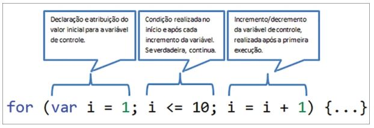
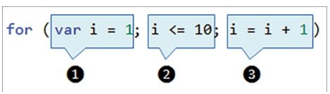
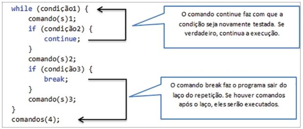

# Capítulo 4 - Repetições

As estruturas de repetição permitem fazer com que um ou mais comandos em um programa sejam executados várias vezes. Essas estruturas, também denominadas laços de repetição ou loops, complementam a programação sequencial e a programação condicional.

As estruturas de repetição são muito utilizadas para manipular listas de dados, como a lista de produtos em promoção em um site de comércio eletrônico. Monta-se o layout de apresentação de cada produto, com imagem, descrição, marca e preço, e, a partir de um laço de repetição, percorrem-se todos os itens para exibi-los no site. Outro exemplo de uso dos loops é a apresentação dos valores das parcelas de um financiamento de um imóvel. Imagine calcular e exibir no programa o valor e a data de vencimento das 360 parcelas do financiamento... Com um laço de repetição, o processo se torna muito mais simples.

Para construir as estruturas de repetição em um programa, a linguagem JavaScript dispõe dos comandos for, while e do... while. Pequenas particularidades fazem com que o uso de cada um deles seja mais adequado para uma ou outra situação.

###  Repetição com variável de controle: laços for

A sintaxe do comando for é composta de três instruções, que definem: a) o valor inicial da variável de controle; b) a condição que determina se a repetição deve ou não continuar; c) o incremento ou decremento da variável controle.

Entre as chaves {} devem ser inseridos os comandos que serão executados repetidas vezes. O incremento i = i + 1 pode ser abreviado por i++. 

A sequência de execução das instruções é a seguinte: 1 e 2 (executa), 3 e 2 (executa), 3 e 2 (executa), .... (segue 3 e 2 até a condição ficar falsa ).

Exemplo:

    var numeros = "";

    for (var i = 1; i < 4; i = i + 1) {
        numeros = numeros + i + " ";
    }

    outResposta.textContent = numeros;

Após a variável numeros ser declarada e inicializada, as seguintes operações
são realizadas pelo laço for:

1. A variável i é declarada e recebe o valor 1.
2. O teste condicional é realizado (i < 4) e retorna verdadeiro.
3. Portanto, o comando do laço é executado: o valor de i (1) é atribuído à variável numeros, que recebe ela mesmo + i, ou seja, numeros = "1 ".
4. Volta-se ao comando for e a terceira instrução é executada: i = i + 1. Logo, i = 2.
5. O teste condicional é novamente realizado (i < 4) e continua verdadeiro.
6. Assim o comando do laço é executado, o valor de i (2) é atribuído à variável numeros, que recebe ela mesmo + i: numeros = "1 2 ".
7. A terceira instrução do comando for é novamente executada, i = i + 1. Logo, i = 3.
8. O teste condicional é realizado (i < 4) e prossegue verdadeiro.
9. Mais uma vez, i (3) é atribuído a numeros, junto ao conteúdo anterior dessa variável. Agora, numeros = "1 2 3 ".
10. Volta-se à execução da terceira instrução do for: i = i + 1. Logo, i = 4.
11. O teste condicional é realizado (i < 4) e retorna falso. O laço é

Outro exemplo:

Nosso primeiro programa sobre repetições deve ler um número e apresentar a tabuada desse número.

Código CSS:

    h1 { border-bottom-style: inset; }
    pre { font-size: 1.2em; }

Código HTML:

    <h1> Programa Tabuada </h1>

    

        Número:
        <input type="text" id="inNumero">
    

    <input type="button" value="Mostrar Tabuada" id="btMostrar">

    <pre id="outTabuada"></pre>

Código JS:

    function mostrarTabuada() {
        // cria referência aos elementos da página
        var inNumero = document.getElementById("inNumero");
        var outTabuada = document.getElementById("outTabuada");

        // converte conteúdo do campo inNumero
        var numero = Number(inNumero.value);

        // valida o número
        if (numero == 0 || isNaN(numero)) {
            alert("Informe um número válido...");
            inNumero.focus();
            return;
        }

        // cria uma variável do tipo String, que irá concatenar a resposta
        var resposta = "";

        // cria um laço de repetição
        for (var i = 1; i <= 10; i++) {
            // a variável resposta vai acumulando os novos conteúdos
            resposta = resposta + numero + " x " + i + " = " + numero * i + "\n";
        }

        // o conteúdo da tag pre é alterado para exibir a tabuada do num
        outTabuada.textContent = resposta;
    }
    // cria referência ao botão e após associa function ao evento click
    var btMostrar = document.getElementById("btMostrar");
    btMostrar.addEventListener("click", mostrarTabuada);

O nosso segundo exemplo ilustra a montagem de uma estrutura de repetição decrescente, com o valor inicial informado pelo usuário.

Código HTML:

    <h1>Programa Números Decrescentes</h1>

    

        Número:
        <input type="text" id="inNumero">
    

    <input type="button" value="Decrescer Até 1" id="btDecrescer">

    <h3 id="outResposta"></h3>

Código JS:

    function listarNumeros() {
        // cria referência aos elementos que a function irá manipular
        var inNumero = document.getElementById("inNumero");

        var outResposta = document.getElementById("outResposta");

        var numero = Number(inNumero.value); // obtém o número informado

        // verifica validade do número
        if (numero == 0 || isNaN(numero)) {
            alert("Informe um número válido...");
            inNumero.focus();
            return;
        }

        // inicializa variável resposta
        var resposta = "Entre " + numero + " e 1: ";

        // cria um for decrescente
            for (var i = numero; i > 0; i = i - 1) {
            // resposta vai acumulando números (e vírgulas)
            resposta = resposta + i + ", ";
        }

        // altera o conteúdo de outResposta
        outResposta.textContent = resposta;
    }
    // referencia elemento e após associa function ao evento click
    var btDecrescer = document.getElementById("btDecrescer");
    btDecrescer.addEventListener("click", listarNumeros);

###  Repetição com teste no início: laços while

Um laço de repetição também pode ser criado com o comando while, que realiza um teste condicional logo no seu início, para verificar se os comandos do laço serão ou não executados. A tradução da palavra while, que em português significa enquanto, define bem o seu funcionamento: "enquanto a condição for verdadeira, execute". A sintaxe do comando while é a seguinte:

    while(condição){
        comandos;
    }

As estruturas de repetição com teste no início, representadas pelo comando while, são utilizadas principalmente em programas que manipulam arquivos, para repetir a leitura de uma linha enquanto não atingir o final do arquivo. Elas também podem ser utilizadas para realizar as operações desenvolvidas com o comando for. Exemplo o programa dos números decrescentes, poderiamos escrever da seguinte form com o while:

    // declara e inicializa a variável i
    var i = numero;

    // enquanto i maior que 0
    while (i > 0) {
        // acumula em resposta os números em ordem decrescente
        resposta = resposta + i + ", ";

        // subtrai 1 no valor da variável i (i=i-1)
        i--;
    }

Como o teste é realizado no início, é possível que os comandos do while não sejam executados.

### Repetição com teste no final: laços do.. while

Outra forma de criar laços de repetição em um programa é com a utilização do comando do.. while, cuja sintaxe é representada a seguir:

    do {
        comandos;
    } while (condição);

Uma sútil, porém importante, diferença entre as estruturas de repetição while e do.. while é a seguinte: com o comando while, a condição é verificada no início; enquanto, com o comando do.. while, a condição é veriicada no final. Ou seja, com o do.. while, fica garantido que uma vez, no mínimo, os comandos que pertencem ao laço serão executados.

Exemplo com do.. while

Código JS:

    // solicita o número e repete a leitura enquanto inválido
    do {
        var num = Number(prompt("Número: "));
        if (num == 0 || isNaN(num)) {
            alert("Digite um número válido...");
        }
    } while (num == 0 || isNaN(num));

    // declara e inicializa variável que irá exibir pares
    var pares = "Pares entre 1 e " + num + ": ";

    // isola o primeiro par (para evitar última vírgula)
    if (num > 1) {
        pares = pares + "2";
    }

    // laço para acumular pares (inicia em 4, pois o 2 já foi atribuído)
    for (var i = 4; i <= num; i = i + 2) {
        pares = pares + ", " + i;
    }

    // exibe lista dos números pares
    alert(pares);

### Interrupções nos laços (break e continue)

As linguagens de programação dispõem de dois comandos especiais para serem utilizados nas estruturas de repetição. São eles: break e continue. O break sai do laço de repetição, enquanto que o continue retorna ao início do laço.

Os comandos break e continue podem ser utilizados nas três estruturas de repetição disponíveis: for, while ou do... while. Caso o comando continue seja executado em um laço for, o incremento ou decremento da variável de controle ocorre normalmente, como se o laço tivesse sido executado até o seu final.

Exemplo:

    alert("Digite 0 para sair");

    // início da repetição
    do {
        var num = Number(prompt("Número: "));

        if (num == 0 || isNaN(num)) {
            var sair = confirm("Confirma saída?"); // solicita confirmação do usuário

            if (sair) {
                break; // sai da repetição
            } else {
                continue; // volta ao início do laço
            }
        }

        // se par, mostra o dobro; ímpar, mostra o triplo
        if (num % 2 == 0) {
            alert("O dobro de " + num + " é: " + num * 2);
        } else {
            alert("O triplo de " + num + " é: " + num * 3);
        }

    } while (true); // // enquanto verdade (só sai do laço, pelo break)

    alert("Bye, bye...");

### Contadores e acumuladores

O uso de contadores e acumuladores em um programa permite a exibição de contagens e totalizações. Essas operações são realizadas sobre os dados manipulados pelo programa. Os contadores ou acumuladores possuem duas características principais:

- A variável contadora ou acumuladora deve receber uma atribuição inicial (geralmente zero).
- A variável contadora ou acumuladora deve receber ela mesma mais algum valor.

A diferença entre os contadores e os acumuladores é que o contador recebe ele mesmo mais 1 (ou algum valor constante), enquanto o acumulador recebe ele mesmo mais uma variável.

Exemplo:

Código HTML:

    <h1>Programa Contas do Mês</h1>

    

        Descrição da Conta:
        <input type="text" id="inDescricao">
    

    
Valor a Pagar R$:
        <input type="text" id="inValor">
    

    <input type="button" value="Registrar Conta" id="btRegistrar">

    <pre id="outListaContas" ></pre>
    <pre id="outTotal" ></pre>

Código JS:

    // declara e inicializa contadores e acumuladores (variáveis globais)
    var numContas = 0;
    var valTotal = 0;

    // variável string que acumula as contas
    var resposta = "";

    function registrarConta() {
        // cria referência aos elementos da página manipulados pela function
        var inDescricao = document.getElementById("inDescricao");
        var inValor = document.getElementById("inValor");

        var outListaContas = document.getElementById("outListaContas");
        var outTotal = document.getElementById("outTotal");

        // obtém conteúdo dos campos
        var descricao = inDescricao.value;
        var valor = Number(inValor.value);

        // verifica preenchimento dos campos
        if (descricao == "" || valor == 0 || isNaN(valor)) {
            alert("Informe os dados corretamente...");
            inDescricao.focus();
            return;
        }

        // adiciona valores ao contador e acumulador
        numContas++;

        valTotal = valTotal + valor;

        // concatena as contas
        resposta = resposta + descricao + " - R$: " + valor.toFixed(2) + "\n";

        // altera o conteúdo das tags de resposta
        outListaContas.textContent = resposta + "--------------------------------";
        outTotal.textContent = numContas + " Conta(s) - Total R$: " +
        valTotal.toFixed(2);

        // limpa campos e posiciona cursor em inDescricao
        inDescricao.value = "";
        inValor.value = "";
        inDescricao.focus();
    }

    // referencia elemento e após associa function ao evento click
    var btRegistrar = document.getElementById("btRegistrar");
    btRegistrar.addEventListener("click", registrarConta);

### Exercícios

<b>a)</b> Elaborar um programa que leia o nome de uma fruta e um número. O programa deve repetir a exibição do nome da fruta, de acordo com o número informado. Utilize o “*” para separar os nomes.

<b>b)</b> Digamos que o número de chinchilas de uma fazenda triplica a cada ano, após o primeiro ano. Elaborar um programa que leia o número inicial de chinchilas e anos e informe ano a ano o número médio previsto de chinchilas da fazenda. Validar a entrada para que o número inicial de chinchilas seja maior ou igual a 2 (um casal).

<b>c)</b> Elaborar um programa que leia um número e verifique se ele é ou não é perfeito. Un número dito perfeito é aquele que é igual à soma dos seus divisores inteiro (exceto o próprio número). O programa deve exibir os divisores do número e a soma deles.

<b>d)</b> Elaborar um programa que leia um número e exiba estrelas na página, em linhas diferentes. A cada nova linha, o número de estrelas deve ser incrementado. Observação: caso você informe um valor alto, as linhas podem ultrapassar o tamanho da imagem e se alinhar à margem esquerda da página.

