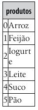
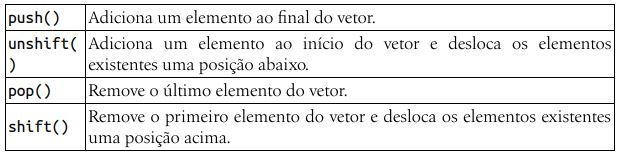
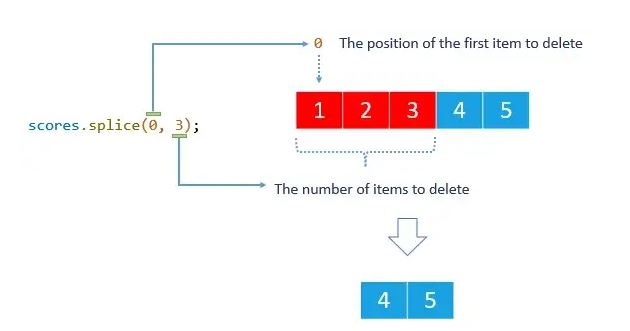
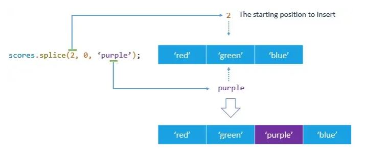
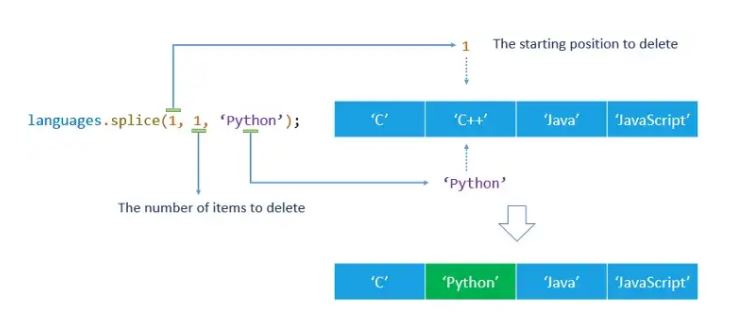

# Capítulo 5 - Vetores

Os vetores ou arrays são estruturas que permitem armazenar uma lista de dados na memória principal do computador. Eles são úteis para inserir ou remover itens de uma lista de compras ou de alunos de uma turma, por exemplo. Com os vetores é possível recuperar todos os itens inseridos na lista. Um índice numérico (que começa em 0) identifica cada elemento da lista.

Exemplo:

Para referenciar um item do vetor, devemos indicar seu nome, seguido por um número entre colchetes que aponta para o seu índice. É importante reforçar que o vetor inicia pelo índice 0. Portanto, para obter o primeiro produto inserido no vetor, devemos utilizar: produtos[0]. Também poderíamos alterar um produto da lista, com uma nova atribuição de conteúdo a um elemento do vetor, como:

    produtos[2] = "Queijo";

Na linguagem JavaScript, não é necessário indicar o número total de elementos do vetor na sua declaração. Para declarar um vetor em JavaScript, devemos utilizar uma das seguintes formas:

    var produtos = [];
    var produtos = new array();

Prefira utilizar a primeira forma, que é recomendada. Também é possível declarar um vetor com algum conteúdo inicial (e, mesmo assim, adicionar ou remover itens no vetor no decorrer do programa). A instrução a seguir declara e insere três produtos no vetor:

    var produtos = ["Arroz", "Feijão", "Iorgute"];

###  Inclusão eexclusão de itens

Depois de realizarmos a declaração do vetor, podemos gerenciar a lista com a inclusão e a exclusão de itens a esse vetor.

Exemplo:

    var cidades = ["Pelotas"]; // declara e define conteúdo inicial do vetor

    // cidades[0] = "Pelotas"

    cidades.push("São Lourenço"); // adiciona cidade ao final do vetor

    // cidades[0] = "Pelotas"
    // cidades[1] = "São Lourenço";

    cidades.unshift("Porto Alegre"); // adiciona ao início e desloca as demais

    // cidades[0] = "Porto Alegre"
    // cidades[1] = "Pelotas"
    // cidades[2] = "São Lourenço";

    var retirada = cidades.pop(); // remove a última cidade do vetor

    // cidades[0] = "Porto Alegre"
    // cidades[1] = "Pelotas"

    retirada = cidades.shift(); // remove a primeira e "sobe" as demais
    // cidades[0] = "Pelotas"

Note, no código anterior, que as operações de exclusão de itens são atribuídas à variável retirada. Essa variável recebe o conteúdo do elemento removido do vetor.

Também é possível inserir elementos em uma posição específica no vetor e para isso utilizamos o método <b>splice()</b>. Exemplo:

##### Deletando elementos usando splice()

Para deletar elementos em um array, você passa dois argumentos para o método splice() da seguinte forma:

    Array.splice(position, num);

O argumento position determina a posição do primeiro item a ser excluído e o argumento num determina o número de elementos a serem excluídos.

O método splice() altera o array original e retorna um array que contém os elementos excluídos. Exemplo:

    let scores = [1, 2, 3, 4, 5];

A instrução a seguir exclui três elementos do array scores começando no primeiro elemento e cria um novo array deletedScores que armazena os valores excluídos:

    let deletedScores = scores.splice(0, 3);

O array scores agora contém dois elementos:

    console.log(scores); //[4, 5]

E o array deletedScores contém 3 elementos:

    console.log (deletedScores); // [1, 2, 3]

##### Inserindo elementos usando splice()

Você pode inserir um ou mais elementos em uma matriz (em um array) passando 3 ou mais argumentos para o método splice() com o segundo argumento igual a zero.

Considere a seguinte sintaxe:

    Array.splice (position, 0, new_element_1, new_element_2, ...);

- O argumento position determina a posição inicial da matriz em que os novos elementos serão inseridos.
- O segundo argumento é zero 0 que dá o comando ao método splice() para não excluir nenhum elemento.
- O terceiro argumento, o quarto e assim por diante, são os valores dos novos elementos a serem inseridos no array.

Observe que o método splice() realmente altera o array original. Além disso, o método splice() não remove nenhum elemento nesse caso ele retorna um array vazio. Por exemplo:

Suponha que você tenha uma matriz (um array) chamada colors com 3 strings:

    let colors = ['red', 'green', 'blue'];

A instrução a seguir insere um elemento após o segundo elemento:

    colors.splice(2, 0, 'pruple');

O array colors agora tem 4 elementos com o novo elemento inserido na segunda posição.

    console.log (colors); //['red', 'green', 'purple', 'blue']

Você pode inserir mais de um elemento, passando o quarto argumento, o quinto, e assim por diante. Veja o exemplo:

    colors.splice(1, 0, 'yellow', 'pink');
    console.log(colors); // ["red", "yellow", "pink", "green", "purple", "blue"]

##### Substituindo elementos usando o splice()

O método splice() permite inserir novos elementos e excluir elementos existentes em um array simultaneamente.

Para fazer isso você passa pelo menos 3 argumentos, sendo o segundo que vai especificar o número de ítens a serem excluídos e o terceiro indicando os elementos a serem inseridos.

Observe que o número de elementos a serem excluídos não precisa ser o mesmo número de elementos a serem inseridos.

Suponha que você tenha um array de linguagens de programação com quatro elementos, como a seguir:

    let languages = ['C', 'C++', 'Java', 'JavaScript'];

A instrução a seguir substitui o segundo elemento por um novo:

    languages.splice(1, 1, 'Python');

O array languages agora ainda tem 4 elementos com o novo segundo elemento sendo Python em vez de C++.

    console.log(languages); // ["C", "Python", "Java", "JavaScript"]

###  Tamanho do vetor e exibição dos itens

Uma propriedade importante utilizada na manipulação de vetores é a propriedade length, que retorna o número de elementos do vetor. Vamos consultá-la quando quisermos percorrer a lista, realizar exclusões (para verificar antes da exclusão, se l a lista está vazia) ou, então, para exibir o número total de itens do vetor.
Para percorrer e exibir os elementos do vetor cidades, podemos utilizar o comando for, indicando que a variável de controle i começa em 0, e repetir o laço enquanto i for menor que cidades.length. Exemplo:

    var cidades = ["Pelotas", "São Lourenço", "Porto Alegre"];

    for (var i = 0; i < cidades.length; i++) {
        alert(cidades[i]);
    }

Outra forma de exibir o conteúdo do vetor é pelo uso dos métodos toString() e join(). Eles convertem o conteúdo do vetor em uma string, sendo que no método toString() uma vírgula é inserida entre os elementos e no join() podemos indicar qual caractere vai separar os itens. Referenciar apenas o nome do vetor ou o nome seguido pelo método join() sem o caractere de separação gera uma saída idêntica à toString(). No script a seguir, os métodos toString() e join() são exemplificados:

    var cidades = ["Pelotas", "São Lourenço", "Porto Alegre"];
    alert(cidades.toString() + "\n\n" + cidades.join(" - "));

Exemplo:

Código CSS:

    h1 { border-bottom-style: inset; }
    pre { font-size: 1.2em; }
    .fonteAzul { color: blue; }
    .oculta { display: none; }
    .exibe { display: inline; }
    .italico { font-style: italic; }

Código HTML:

    <h1>Consultório Odontológico</h1>

    

    Paciente:
        <input type="text" id="inPaciente" autofocus>
        <input type="button" value="Adicionar" id="btAdicionar">
        <input type="button" value="Urgência" id="btUrgencia">
        <input type="button" value="Atender" id="btAtender">
    

    <h3>Em Atendimento:
        
    </h3>

    <pre id="outLista"></pre>

Código JS:

    var pacientes = []; // declara vetor global

    function adicionarPaciente() {
        // cria referência aos elementos de entrada e saída de dados da página
        var inPaciente = document.getElementById("inPaciente");

        var outLista = document.getElementById("outLista");

        var nome = inPaciente.value; // obtém nome do paciente

        // verifica preenchimento do nome do paciente
        if (nome == "") {
            alert("Informe o nome do paciente");
            inPaciente.focus();
            return;
        }

        pacientes.push(nome); // adiciona o nome no final do vetor

        var lista = ""; // string para concatenar pacientes

        // percorre os elementos do vetor
        for (i = 0; i < pacientes.length; i++) {
            lista += (i + 1) + ". " + pacientes[i] + "\n";
        }

        // altera o conteúdo da tag outLista
        outLista.textContent = lista;

        // limpa campo e posiciona cursor em inPaciente
        inPaciente.value = "";
        inPaciente.focus();
    }

    // cria referência ao btAdicionar e associa function ao evento click
    var btAdicionar = document.getElementById("btAdicionar");
    btAdicionar.addEventListener("click", adicionarPaciente);

    function atenderPaciente() {
        // verifica se vetor pacientes está vazio
        if (pacientes.length == 0) {
            alert("Não há pacientes na lista de espera");
            inPaciente.focus();
            return;
        }

        // cria referência aos elementos de saída de dados
        var outAtendimento = document.getElementById("outAtendimento");
        var outLista = document.getElementById("outLista");

        // remove paciente do início da fila (e obtém nome)
        var atender = pacientes.shift();

        // exibe nome do paciente em atendimento
        outAtendimento.textContent = atender;

        // string para concatenar pacientes
        var lista = "";

        // percorre os elementos do vetor
        for (i = 0; i < pacientes.length; i++) {
            lista += (i + 1) + ". " + pacientes[i] + "\n";
        }

        // altera o conteúdo da tag outLista
        outLista.textContent = lista;
    }

    var btAtender = document.getElementById("btAtender");
    btAtender.addEventListener("click", atenderPaciente);

    function adicionarUrgencia() {
        // cria referência aos elementos de entrada e saída de dados da página
        var inPaciente = document.getElementById("inPaciente");

        var outLista = document.getElementById("outLista");

        var nome = inPaciente.value; // obtém nome do paciente

        // verifica preenchimento do nome do paciente
        if (nome == "") {
            alert("Informe o nome do paciente");
            inPaciente.focus();
            return;
        }

        pacientes.unshift(nome); // adiciona o nome no final do vetor

        var lista = ""; // string para concatenar pacientes

        // percorre os elementos do vetor
        for (i = 0; i < pacientes.length; i++) {
            lista += (i + 1) + ". " + pacientes[i] + "\n";
        }

        // altera o conteúdo da tag outLista
        outLista.textContent = lista;
        
        // limpa campo e posiciona cursor em inPaciente
        inPaciente.value = "";
        inPaciente.focus();
    }
        
    // cria referência ao btAdicionar e associa function ao evento click
    var btUrgencia = document.getElementById("btUrgencia");
    btUrgencia.addEventListener("click", adicionarUrgencia);

### Localizar conteúdo

Como o número de elementos de um vetor pode ser grande, as linguagens de programação dispõem de alguns métodos para nos auxiliar no controle de seu conteúdo. Um desses controles refere-se à verificação da existência ou não de um conteúdo do vetor. Os métodos indexOf() e lastIndexOf() cumprem esse papel.

No indexOf(), a busca ocorre a partir do início do vetor. Já no lastIndexOf() a busca é do final ate o seu início. Caso o conteúdo exista no vetor, o número do índice da primeira ocorrência desse conteúdo é retornado. Caso o conteúdo pesquisado não exista no vetor, o valor -1 é devolvido pelo método. Exemplo:

    var idades = [5, 6, 8, 3, 0, 6];
    alert(idades.indexOf(6)); // retorna 1
    alert(idades.lastIndexOf(6)); // retorna 5
    alert(idades.indexOf(7)); // retorna -1

Exemplo com método indexOf():

Código HTML:

    <h1>Descubra o Número</h1>

    

        Número:
        <input type="text" id="inNumero" autofocus>
        <input type="button" value="Apostar" id="btApostar">
        <input type="button" value="Jogar Novamente" id="btJogar" class="oculta">
    

    <h3> 
        Erros:
        0
    </h3>

    <h3> 
        Chances:
        6
    </h3>

    <h3 id="outDica" class="italico">
        Dica: É um número entre 1 e100
    </h3>

Código JS:

    // declara vetor de escopo global que irá conter os números já apostados
    var erros = [];

    // gera um número aleatório entre 1 e 100
    var sorteado = Math.floor(Math.random() * 100) + 1;

    // declara constante com o número de chances
    const CHANCES = 6;

    function apostarNumero() {
        // cria referência ao campo de entrada e obtém seu conteúdo
        var inNumero = document.getElementById("inNumero");
        var numero = Number(inNumero.value);

        // valida o número
        if (numero <= 0 || numero > 100 || isNaN(numero)) {
            alert("Informe um número válido...");
            inNumero.focus();
            return;
        }

        // referencia espaços das saídas de dados
        var outDica = document.getElementById("outDica");
        var outErros = document.getElementById("outErros");
        var outChances = document.getElementById("outChances");

        // se aposta do jogador for igual ao número sorteado
        if (numero == sorteado) {
            alert("Parabéns!! Você Acertou!!!");
            // troca status dos botões
            btApostar.disabled = true;
            btJogar.className = "exibe";
            outDica.textContent = "Parabéns!! Número sorteado: " + sorteado;
        } else {
            // se número existe no vetor erros
            if (erros.indexOf(numero) >= 0) {
                alert("Você já apostou o número " + numero + ". Tente outro...");

            } else {
                erros.push(numero); // adiciona número ao vetor

                var numErros = erros.length; // obtém tamanho do vetor
                var numChances = CHANCES - numErros; // calcula nº de chances

                // exibe nº de erros, conteúdo do vetor e nº de chances
                outErros.textContent = numErros + " (" + erros.join(", ") + ")";
                outChances.textContent = numChances;

                if (numChances == 0) {
                    alert("Suas chances acabaram...");
                    btApostar.disabled = true;
                    btJogar.className = "exibe";
                    outDica.textContent = "Game Over!! Número Sorteado: " +
                    sorteado;

                } else {
                    // usa operador ternário (condicional) para mensagem da dica
                    var dica = numero < sorteado ? "maior" : "menor";
                    outDica.textContent = "Dica: Tente um número " + dica + " que " + numero;
                }
            }
        }

        // Limpa campo de entrada e posiciona cursor neste campo
        inNumero.value = "";
        inNumero.focus();
    }
    var btApostar = document.getElementById("btApostar");
    btApostar.addEventListener("click", apostarNumero);

    function jogarNovamente() {
        location.reload(); // recarrega a página
    }

    var btJogar = document.getElementById("btJogar");
    btJogar.addEventListener("click", jogarNovamente);

Lembrando que a função Math.random() retorna um valor entre 0 e 1, por isso utilizamos junto com ele a função Math.floor(). No nosso exemplo utilizamos var sorteado = Math.floor(Math.random() * 100) + 1;, porque queriamos um número entre 1 e 100 incluindo o 1, mas não incluindo o 100 e nem o zero.

###  Vetores de objetos

Também é possível definir um vetor que contenha uma lista de objetos, com alguns atributos desse objeto. Poderiamos, por exemplo, ter o objeto produto, com os atributos nome, marca e preço. Ou o objeto filme, com os atributos título, gênero e duração. exemplo:

    var carros = [];

    carros.push({ modelo: "Fusca", preco: 6500 });
    carros.push({ modelo: "Escort", preco: 7800 });

    for (var i = 0; i < carros.length; i++) {
        alert(carros[i].modelo + " - R$: " + carros[i].preco);
    }

###  Pesquisar e filtrar dados

São exemplos de filtros em conjunto de dados a obtenção do nome e de nota dos alunos aprovados em uma prova, dos clientes com saldo negativo em uma agência bancária ou, então, das contas em atraso de uma empresa.

Nos programas que realizam essas operações um cuidado extra é necessário: o de informar ao usuário quando uma pesquisa não encontrou dados. Imagine que você está consultando uma página de uma videolocadora e há um campo para pesquisar pelo título do filme. Caso o sistema não localize filmes com a palavra informada, é necessário retornar essa informação para o usuário. Caso contrário, ele ficará na espera, sem saber se a pesquisa foi concluída ou não. 

Exemplo:

    var idades = [12, 20, 15, 17, 14];

    for (var i = 0; i < idades.length; i++) {
        if (idades[i] >= 18) {
            alert(idades[i]);
        }
    }

Exemplo: 

O programa é para a “Revenda
Herbie”, que vai armazenar em um vetor de objetos o modelo e o preço dos carros disponíveis na revenda. Um botão de “Filtrar por Preço” vai solicitar o valor máximo de que um determinado cliente dispõe para a compra do veículo.

Código HTML:

    <h1>Revenda Herbie</h1>

    

        Modelo:
        <input type="text" id="inModelo" autofocus> 
    

    

        Preço R$:
        <input type="text" id="inPreco">
        <input type="button" value="Adicionar" id="btAdicionar">
    

    <input type="button" value="Listar Todos" id="btListar">
    <input type="button" value="Filtrar por Preço" id="btFiltrar">

    <pre id="outLista"></pre>

Código JS:

    var carros = []; // declara vetor global

    function adicionarCarros() {
        // Cria referência aos elementos contendo os dados de entrada
        var inModelo = document.getElementById("inModelo");
        var inPreco = document.getElementById("inPreco");

        var modelo = inModelo.value; // obtém conteúdo dos campos
        var preco = Number(inPreco.value);

        // verifica preenchimento dos campos
        if (modelo == "" || preco == 0 || isNaN(preco)) {
            alert("Informe corretamente os dados");
            inModelo.focus();
            return;
        }

        // adiciona dados ao vetor de objetos
        carros.push({ modelo: modelo, preco: preco });

        // limpa campos e posiciona cursor em inModelo
        inModelo.value = "";
        inPreco.value = "";
        inModelo.focus();
        listarCarros(); // chama function que lista os carros
    }

    // cria referência ao btAdicionar e associa function ao evento click deste botão
    var btAdicionar = document.getElementById("btAdicionar");
    btAdicionar.addEventListener("click", adicionarCarros);

    function listarCarros() {
        // verifica se vetor está vazio
        if (carros.length == 0) {
            alert("Não há carros na lista");
            return;
        }

        var lista = ""; // para concatenar lista de carros

        // percorre os elementos do vetor
        for (var i = 0; i < carros.length; i++) {
            // adiciona à lista, cada objeto do vetor
            lista += carros[i].modelo + " - R$: " + carros[i].preco.toFixed(2) + "\n";
        }
        
        // referencia elemento e altera conteúdo exibido
        document.getElementById("outLista").textContent = lista;
    }

    var btListar = document.getElementById("btListar");
    btListar.addEventListener("click", listarCarros);

    function filtrarCarros() {
        // faz a leitura do valor máximo a partir do método prompt
        var maximo = Number(prompt("Qual o valor máximo que o cliente deseja pagar?"));

        // se não preencheu ou conteúdo inválido ...
        if (maximo == 0 || isNaN(maximo)) {
            return; // ... retorna
        }

        // para concatenar lista de carros que obedecem ao critério de pesquisa / filtro
        var lista = "";

        // percorre todos os elementos do vetor
        for (var i = 0; i < carros.length; i++) {
            // verifica se o preço é inferior (ou igual) ao máximo
            if (carros[i].preco <= maximo) {
                lista += carros[i].modelo + " - R$: " + carros[i].preco.toFixed(2) + "\n";
            }
        }

        var outLista = document.getElementById("outLista"); // cria referência a outLista

        // se a lista esta vazia, significa que nenhum veículo foi encontrado (no for)
        if (lista == "") {
            outLista.textContent = "Não há carros com preço até R$ " + maximo.toFixed(2);
        } else {
            // senão, mostra os veículos obtidos
            outLista.textContent = "Carros até R$ " + maximo.toFixed(2) + "\n------------------------\n" + lista;
        }
    }

    var btFiltrar = document.getElementById("btFiltrar");
    btFiltrar.addEventListener("click", filtrarCarros);

###  Classificar os itens do vetor

JavaScript dispõe do método sort() para classificar os itens de um vetor em ordem alfabética. Ao excutar o método sort(), o vetor passa a ficar ordenado. Caso seja necessário manter a lista na ordem original e apenas apresentar em uma função os dados ordenados, é possivel criar uma cópia do vetor original a partir do método slice().

Caso seja necessário classificar os dados em ordem decrescente, podemos utilizar em conjunto os métodos sort() e reverse(), como o nome sugere, inverte a ordem dos elementos de um vetor. Exemplo:

    var nomes = ["Pedro", "Ana", "João"];
    nomes.sort();
    alert(nomes.join(", ")); // Ana, João, Pedro
    nomes.reverse();
    alert(nomes.join(", ")); // Pedro, João, Ana

Um detalhe importante sobre o processo de ordenação de listas em
JavaScript é que os dados do vetor são classificados como strings, mesmo que o seu conteúdo seja formado apenas por números. Uma classificação de números como string faz com que o número "2" seja considerado maior que "100" por exemplo. Isso porque a comparação é realizada da esuqerda para direita, caractere por caractere.

Para contornar essa situação, é possível de definir uma função que vai subtrair os dados, de dois a dois, em cada comparação. Exemplo:

    var numeros = [50, 100, 2];

    numeros.sort();
    alert(numeros.join(", ")); // 100, 2, 50

    numeros.sort(function (a, b) { return a - b });
    alert(numeros.join(", ")); // 2, 50, 100

### Exercícios

<b>a)</b> Elaborar um programa para gerar uma tabela com os jogos de uma fase eliminatória de um campeonato. O programa deve conter três funções (a serem executadas no evento click de cada botão) para: 1) validar o preenchimento, adicionar um clube ao vetor e listar os clubes; 2) listar os clubes (se houver); 3) montar a tabela de jogos, no formato primeiro x último, segundo x penúltimo e assim por diante. Exibir mensagem e não listar a tabela de jogos, caso o número de clubes informados seja ímpar.

<b>b)</b> Elaborar um programa que adicione números a um vetor. O programa deve impedir a inclusão de números repetidos. Exibir a lista de números a cada inclusão. Ao clicar no botão Verificar Ordem, o programa deve analisar o conteúdo do vetor e informar se os números estão ou não em ordem crescente.

<b>c)</b> Elaborar um programa que leia nome e número de acertos de candidatos inscritos em um concurso. Listar os dados a cada inclusão. Ao clicar no botão Aprovados 2ª Fase, ler o número de acertos para aprovação dos candidatos para a 2ª fase do concurso. O programa deve, então, exibir os candidatos aprovados, ou seja, apenas os que obtiveram nota maior ou igual à nota informada. Exibir os candidatos aprovados em ordem decrescente de número de acertos. Caso nenhum candidato tenha sido aprovado, exibir mensagem.

<b>d)</b> Elaborar um programa que leia as últimas notícias da sua região e armazene-as em um vetor. Exibir na página, a cada inclusão, somente a quantidade de notícias cadastradas. O programa deve conter um botão que solicite o número de notícias que o usuário deseja visualizar e, então, liste as notícias em ordem inversa da inclusão. Ou seja, apenas as notícias mais recentes devem ser listadas, de acordo com o número informado pelo usuário. Validar esse número para que seja inferior ou igual à quantidade de notícias cadastradas.

