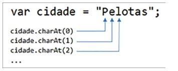

# Capítulo 6 - Strings e Data

Com as propriedades e os métodos de manipulação de strings, é possível verificar se uma senha conta com um número mínimo de caracteres, se é formada por letras e números, se contém, letras maiúsculas e minúsculas e, ainda, se utiliza algum caractere especial na sua composição.

###  Percorrer os caracteres de uma string

Vamos começar nosso estudo sobre os métodos JavaScript disponíveis para a manipulação de cadeias de caracteres por um dos seus métodos mais simples, que é o charAt(). Esse método retorna o caractere de uma posição da palavra. Assim como nos vetores, a posição inicial da string é 0.

A propriedade length, já utilizada para obter o tamanho de um vetor, é importante também na manipulação de strings. Ela retorna o tamanho (número de caracteres) da string. Com a propriedade length e o método charAt(), é possível, portanto, percorrer todos os caracteres de uma string.

Se quisermos verificar, por exemplo, quantas palavras contém o texto de um anúncio, podemos implementar o script descrito a seguir.

    var anuncio = prompt("Anúncio: "); // lê o anúncio
    var tam = anuncio.length; // obtém o tamanho
    var numPalavras = 0; // inicializa contador

    for (var i = 0; i < tam; i++) { // percorre os caracteres do anúncio
        if (anuncio.charAt(i) == " ") { // se encontrou um espaço
            numPalavras++; // incrementa contador
        }
    }

    // exibe anúncio e número de palavras (que é o nº de espaços + 1)
    alert("Anúncio: " + anuncio + "\nNº Palavras: " + (numPalavras + 1));

O programa “Qual é a fruta?” deve ler uma palavra (sugere-se uma fruta) e exibir, após o clique no botão Montar Dica, a letra inicial da fruta e as demais ocorrências dessa letra na palavra. As outras letras não devem ser exibidas, apenas um sublinhado (underline) “_” para representar cada letra. O conteúdo do campo de entrada deve ser substituído por asteriscos.

Código CSS:

    h1 { border-bottom-style: inset; }
    .entreLetras { letter-spacing: 0.5em; }
    .aDireita { text-align: right; }

Código HTML:

    <h1> Programa Qual é a Fruta? </h1>

    
 
        Fruta:
        <input type="text" id="inFruta">
        <input type="button" value="Montar Dica" id="btMontar">
    

    <h3> 
        Dica:
        
    </h3>

Código JS:

    function montarDica() {
        // cria referência aos elementos da página
        var inFruta = document.getElementById("inFruta");
        var outDica = document.getElementById("outDica");

        // obtém conteúdo do campo de entrada
        var fruta = inFruta.value;

        // se vazio, exibe alerta, posiciona em inFruta e retorna
        if (fruta == "") {
            alert("Informe a fruta...");
            inFruta.focus();
            return;
        }

        var resposta = fruta.charAt(0); // letra inicial da fruta
        var estrelas = "*"; // vai concatenar *
        var tam = fruta.length; // obtém tamanho da fruta

        // percorre os demais caracteres da fruta
        for (var i = 1; i < tam; i++) {
            // se a letra da posição da variável de controle for igual à primeira...
            if (fruta.charAt(i) == fruta.charAt(0)) {
                resposta += fruta.charAt(0); // adiciona a letra inicial

            } else { // senão,
                resposta += "_"; // adiciona o sublinhado
            }

            estrelas += "*"; // concatena *
        }

        // exibe a resposta e exibe estrelas (*) em inFruta
        outDica.textContent = resposta;
        inFruta.value = estrelas;
    }

    // cria referência ao botão e após associa function ao evento click
    var btMontar = document.getElementById("btMontar");
    btMontar.addEventListener("click", montarDica);

### Converter para letras maiúsculas ou minúsculas

Para converter para letras maiúsculas ou minúsculas os caracteres de uma palavra, a linguagem JavaScript dispõe dos métodos toUpperCase() e toLowerCase() que devem ser aplicados na palavra ou na letra que se deseja realizar a conversão.

O uso desses métodos, além de servir para apresentar uma palavra em caixa alta ou baixa, também é importante para auxiliar nas condições envolvendo palavras ou letras. Como sabemos, as linguagens diferenciam as letras maiúsculas de suas equivalentes minúsculas em uma comparação. Assim, utilizar esses métodos pode simplificar algumas condições criadas em um programa. Exemplo:

    while (true) { // cria repetição
        // comandos ...
        var continua = prompt("Continuar (S/N)?"); // lê uma entrada

        if (continua.toUpperCase() == "N") { // converte em maiúscula
            break; // sai da repetição
        }
    }

Basicamente o método toUpperCase() e toLowerCase(), faz com que as palavras fiquem em maiusculas ou minusculas e isso ajuda em alguns sistemas de comparação por exemplo. Podemos também deixar somente alguma letra em maiusculo ou minusculo. Essa função ajuda bastante em alguns casos.

### Cópia de caracteres da string

Além do método para obter um caractere de uma string, as linguagens de programação dispõem também de métodos para recuperar partes da string. Em JavaScript, um desses métodos é o substr(), que contém dois parâmetros: posição inicial da string e número de caracteres a serem copiados. Caso apenas a posição inicial seja informada, todos os caracteres dessa posição até o final da string são copiados. Exemplo:

    var palavra = "saladas";
    var copia1 = palavra.substr(2); // obtém "ladas"
    var copia2 = palavra.substr(2, 4); // obtém "lada"
    var copia3 = palavra.substr(0, palavra.length-1); // obtém "salada"
    var copia4 = palavra.substr(-2); // obtém "as"

###  Localizar um ou mais caracteres na string

Estão lembrados dos métodos indexOf() e lastIndexOf() utilizados para pesquisar um conteúdo em uma lista de dados armazenada em um vetor? Eles também podem ser aplicados sobre uma string e possuem a mesma finalidade: localizar um caractere (ou mais caracteres) agora em uma string. Exemplo:

    var palavra = "saladas";
    var posicao1 = palavra.indexOf("a"); // retorna 1
    var posicao2 = palavra.lastIndexOf("a"); // retorna 5
    var posicao3 = palavra.indexOf("sal"); // retorna 0
    var posicao4 = palavra.indexOf("e"); // retorna -1

Programa como exemplo:

O programa “Nome no Crachá” deve ler o nome completo de um participante em um evento e exibir apenas o seu nome e 
sobrenome.

Código HTML:

    <h1>Programa Nome no Crachá</h1>

    

        Nome do Participante:
        <input type="text" id="inNome">
    

    <input type="button" value="Gerar Crachá" id="btGerar">

    <h3 id="outCracha"></h3>

Código JS:

    function gerarCracha() {
        // cria referência aos elementos da página
        var inNome = document.getElementById("inNome");
        var outCracha = document.getElementById("outCracha");

        // obtém o conteúdo do campo de entrada
        var nome = inNome.value;

        // se vazio ou se não há espaço no nome
        if (nome == "" || nome.indexOf(" ") == -1) {
            alert("Informe o nome completo do participante...");
            inNome.focus();
            return;
        }

        var priEspaco = nome.indexOf(" "); // posição do primeiro espaço
        var ultEspaco = nome.lastIndexOf(" "); // posição do último espaço
        // copia nome e sobrenome usando os parâmetros do substr()

        var cracha = nome.substr(0, priEspaco) + nome.substr(ultEspaco);

        // altera o texto identificado na página por outCracha
        outCracha.textContent = "Crachá: " + cracha;
    }

    // cria referência ao botão e após associa function ao evento click
    var btGerar = document.getElementById("btGerar");
    btGerar.addEventListener("click", gerarCracha);

### Dividir a string em elementos de vetor

Um método a que recorremos com frequência quando se faz necessário trabalhar com strings é o split(). Ele converte a string em elementos de vetor a cada ocorrência de um determinado caractere. Observe o conteúdo da variável sabores a seguir e um exemplo de uso do método split().

    var sabores = "calabresa, 4 queijos, atum, frango";
    var partes = sabores.split(",");

Como uma vírgula (“,”) foi passada como parâmetro para o métodosplit(), o vetor partes vai conter os seguintes elementos:

    // partes[0] = "calabresa"
    // partes[1] = " 4 queijos"
    // partes[2] = " atum"
    // partes[3] = " frango"

### Validar senhas com o método match()

O método match() é ótimo para implementar uma política de senhas em um sistema.Com ele, é possível verificar a existência de letras maiúsculas, minúsculas, números e símbolos em uma string. Seu funcionamento utiliza o conceito de expressões regulares. Uma expressão regular contém um conjunto de caracteres que indicam um padrão a ser pesquisado. Esse assunto, expressões regulares, é amplo e existem diversos livros dedicados ao tema. Vamos utilizá-los de uma forma simples, porém adequada ao que pretendemos aqui: validar os caracteres que compõem uma senha.
A sintaxe básica do método match() a ser utilizada nesta seção está descrita a seguir:

    var vetor = palavra.match(/[A-Z]/g);

/[A-Z]/ é o padrão de expressão regular que se deseja encontrar na palavra. A opção g (global) indica que a pesquisa deve retornar todas as ocorrências dos caracteres na string. O retorno é um vetor contendo os elementos encontrados ou null, caso o padrão não exista na string fornecida. Exemplo:

    var palavra = "#SenhA_123!";
    var vetor1 = palavra.match(/[a-z]/g); // e,n,h
    var vetor2 = palavra.match(/[A-Z]/g); // S,A
    var vetor3 = palavra.match(/[0-9]/g); // 1,2,3
    var vetor4 = palavra.match(/\W|_/g); // #,_,!
    var vetor5 = palavra.match(/[T-Z]/g); // null

Exemplo:

Suponha que, para ser válida, uma senha deva possuir as seguintes regras de composição: a) possuir entre 8 e 15 caracteres; b) possuir, no mínimo, 1 número; c) possuir, no mínimo, 1 letra minúscula; d) possuir, no mínimo, 2 letras maiúsculas; e) possuir, no mínimo, símbolo.

Código HTML:

    <h1> Programa Valida Senha </h1>

    
 
        Senha:
        <input type="text" id="inSenha">
    

    <input type="button" value="Verificar Validade da Senha" id="btVerificar">

    <h3 id="outResposta"></h3>

Código JS:

    function verSenha() {
        // cria referência aos elementos da página
        var inSenha = document.getElementById("inSenha");
        var outResposta = document.getElementById("outResposta");

        // obtém o conteúdo do campo de entrada
        var senha = inSenha.value;

        var erros = []; // vetor com erros

        // verifica se o tamanho da senha é inválido
        if (senha.length < 8 || senha.length > 15) {
            erros.push("possuir entre 8 e 15 caracteres");
        }

        // verifica se não possui números
        if (senha.match(/[0-9]/g) == null) {
            erros.push("possuir números (no mínimo, 1)");
        }

        // verifica se não possui letras minúsculas
        if (!senha.match(/[a-z]/g)) {
            erros.push("possuir letras minúsculas (no mínimo, 1)");
        }

        // verifica se não possui letras maiúsculas ou se possui apenas 1
        if (!senha.match(/[A-Z]/g) || senha.match(/[A-Z]/g).length == 1) {
            erros.push("possuir letras maiúsculas (no mínimo, 2)");
        }

        // verifica se não possui símbolos ou "_"
        if (!senha.match(/[\W|_]/g)) {
            erros.push("possuir símbolos (no mínimo, 1)");
        }

        // se vetor está vazio (significa que não foram encontrados erros)
        if (erros.length == 0) {
            outResposta.textContent = "Ok! Senha Válida"
        } else {
            outResposta.textContent = "Erro... A senha deve " + erros.join(",");
        }
    }
    // cria referência ao botão e após associa function ao evento click
    var btVerificar = document.getElementById("btVerificar");
    btVerificar.addEventListener("click", verSenha);

###  Substituição de caracteres

As expressões regulares também são utilizadas como parâmetro do método replace(),quando quisermos substituir um caractere (ou um conjunto de caracteres) por outro em uma string. Por padrão, a substituição incide apenas sobre a primeira ocorrência do caractere na string. Com o uso de uma expressão regular, com a opção g (global) indicada, a troca ocorre em toda a string. Um detalhe importante é o de que a string mantém o seu conteúdo original. Apenas a variável que recebe o retorno do método ou o conteúdo que é apresentado pelo programa vai conter as substituições dos caracteres indicados. A sintaxe do método replace() é a seguinte:

    var novaStr = str.replace(caracterePesquisado, novoCaractere);

Portanto, se a variável senha tiver o conteúdo indicado a seguir:

    var senha = "ABACAD";

A execução do método replace() sobre essa variável vai produzir os seguintes novos conteúdos:

    var senha1 = senha.replace("A", "X"); // XBACAD
    var senha2 = senha.replace(/A/g, "X"); // XBXCXD

Também podemos utilizar o método replace() para retirar um caractere de uma string. Acompanhe os exemplos:

    var app = "App Controle Financeiro";
    var app2 = app.replace(" ", ""); // AppControle Financeiro
    var app3 = app.replace(/ /g, ""); // AppControleFinanceiro
    var app4 = app.replace(/ /g, "").toLowerCase(); //
    appcontrolefinanceiro

### Manipulação de datas

Para trabalhar com datas em JavaScript, podemos declarar uma variável que recebe a data atual. Ou melhor, declarar um objeto que recebe uma instância do objeto Date. Para realizar essa tarefa, utilize a instrução a seguir:

    var hoje = new Date();

Os métodos getDate(), getMonth() e getFullYear() são utilizados para obter, respectivamente, o dia, o mês e o ano de uma data. Já os métodos setDate(), setMonth() e setFullYear() permitem alterar o dia, o mês e o ano da data. Exemplo:

    var hoje = new Date();
    var amanha = new Date();
    var dia = amanha.getDate();
    amanha.setDate(dia + 1);
    alert("Hoje: " + hoje + "\nAmanhã: " + amanha);

Programa que exibe data e hora atual:

    var hoje = new Date();
    alert("Dia: " + hoje.toDateString() + "\nHora: " + hoje.toTimeString());

Como o valor retornado pelos métodos getDate(), getMonth() e getFullYear() é um número, podemos naturalmente executar operações matemáticas sobre os dados extraídos de uma data. Exemplo:

    var anoAtual = new Date().getFullYear();
    var idade = prompt("Quantos anos você comemora em " + anoAtual + "?");
    var anoNasc = anoAtual - idade;
    alert("Ah... Então você nasceu em " + anoNasc);

Já para calcular a diferença de dias entre duas datas, é necessário entender uma importante particularidade da linguagem JavaScript em relação aos objetos Date. Se quisermos obter a diferença de dias entre duas datas,
podemos subtrair as datas e dividir o valor por 86400000, que é o número de milissegundos de um dia: 24 horas * 60 minutos * 60 segundos * 1000 milissegundos.

Exemplo:

Nosso programa deve ler a data de vencimento e o valor de uma conta. Caso a conta esteja em atraso, o programa deve calcular o valor da multa e dos juros a serem acrescentados ao valor total.

Código HTML:

    <h1> Programa Caixa da Loja </h1>

    

        Data de Vencimento:
        <input type="date" id="inDataVenc" autofocus>
    

    

        Valor da Conta R$:
        <input type="text" id="inValor" class="aDireita">
        <input type="button" value="Calcular Multa e Juros" id="btCalcular">
    

    

        Valor da Multa R$:
        <input type="text" id="outMulta" class="aDireita" readonly>
    

    

        Valor do Juros R$.:
        <input type="text" id="outJuros" class="aDireita" readonly>
    

    

        Total a Pagar R$...:
        <input type="text" id="outTotal" class="aDireita" readonly>
        <input type="button" value="Nova Conta" id="btNovaConta">
    

Código JS:

    const TAXA_MULTA = 2 / 100; // multa por atraso
    const TAXA_JUROS = 0.33 / 100; // juros por dia de atraso

    function calcularMultaJuros() {
        // cria referência aos elementos da página
        var inDataVenc = document.getElementById("inDataVenc");
        var inValor = document.getElementById("inValor");

        var outMulta = document.getElementById("outMulta");
        var outJuros = document.getElementById("outJuros");
        var outTotal = document.getElementById("outTotal");

        // obtém os conteúdos dos campos de entrada
        var dataVenc = inDataVenc.value;
        var valor = Number(inValor.value);

        // valida o preenchimento dos campos
        if (dataVenc == "" || valor == 0 || isNaN(valor)) {
            alert("Informe corretamente os dados da conta...");
            inData.focus();
            return;
        }

        // cria duas variáveis (instancia dois objetos) tipo data
        var hoje = new Date();
        var vencto = new Date();

        // a data vem no formato aaaa-mm-dd
        var partes = dataVenc.split("-");
        vencto.setDate(Number(partes[2]));
        vencto.setMonth(Number(partes[1]) - 1);
        vencto.setFullYear(Number(partes[0]));

        // calcula a diferença de dias entre as datas (em milissegundos)
        var atraso = hoje - vencto;
        var multa = 0; // inicializa multa e juros com 0
        var juros = 0;

        // se conta estiver em atraso ...
        if (atraso > 0) {
            // converte os milissegundos da diferença em dias
            // (1 dia = 24hor x 60min x 60seg x 1000mseg: 86400000)
            // round(): necessário para períodos envolvendo horário de verão
            var dias = Math.round(atraso / 86400000);
            multa = valor * TAXA_MULTA; // calcula multa e juros
            juros = (valor * TAXA_JUROS) * dias;
        }

        var total = valor + multa + juros; // calcula o total
        outMulta.value = multa.toFixed(2); // exibe os valores com 2 decimais
        outJuros.value = juros.toFixed(2);
        outTotal.value = total.toFixed(2);
    }

    // cria referência ao botão e após associa function ao evento click
    var btCalcular = document.getElementById("btCalcular");
    btCalcular.addEventListener("click", calcularMultaJuros);

Exemplo de programa que exibe dia, mês e ano de uma data:

    var hoje = new Date();
    var dia = hoje.getDate();
    var mes = hoje.getMonth();
    var ano = hoje.getFullYear();
    alert(hoje+"\nData: " + dia + "/" + mes + "/" + ano);

### Exercícios

<b>a)</b> Você deve desenvolver um programa de criptografia para transmitir mensagens entre amigos.O programa deve ler uma mensagem e, em seguida, exibi-la criptografada. A criptografia consiste em: a) exibir todas as letras das
posições pares da mensagem; b) exibir todas as letras das posições ímpares da mensagem. O programa deve
conter ainda um botão para decriptografar a mensagem, ou seja, retornar a mensagem original a partir do texto cifrado.

<b>b)</b> Elaborar um programa que leia o nome de um autor de um livro. Em seguida, exiba-o no formato de uma citação bibliográfica com o sobrenome, seguido pelas iniciais do nome.

<b>c)</b> Uma palavra ou frase é um palíndromo quando pode ser lida nos dois sentidos, como RADAR, MUSSUM, ABBA. Elaborar um programa que leia uma frase e informe se ela é ou não um palíndromo (converter a frase para caixa alta).

<b>d)</b> Suponha que o prazo para o pagamento de uma infração de trânsito com desconto seja de 90 dias. Elaborar um programa que leia a data de uma infração e o valor da multa. Informe qual a data limite do pagamento com desconto (até 90 dias) e o valor a ser pago até essa data (com 20% de desconto).