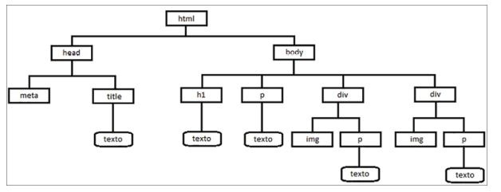

# Inserir elementos HTML via JavaScript

Para ampliar a interação com o usuário, veremos como inserir elementos HTML na página, modificar suas propriedades, estilos, bem como remover esses elementos. Depois de o usuário interagir com os dados da página, é possível enviar esses dados para um Web Services ou uma API, um programa desenvolvido no servidor Web e que pode ter muitas funções, como cadastrar novos contatos ou retornar detalhes dos produtos de uma loja. 

Para “mergulhar” nesse contexto, é necessário entender a forma utilizada pela linguagem HTML para organizar a estrutura dos elementos (tags) que compõem uma página. Dessa forma, será possível determinar com precisão o local da página onde um parágrafo, imagem ou qualquer outro elemento será inserido. Observe o código HTML descrito a seguir:

    <!DOCTYPE html>
    <html lang="pt-br">
    <head>
        <meta charset="UTF-8">
        <title>Lógica de Programação e Algoritmos com JavaScript</title>
    </head>

    <body>
        <h1>Capítulo 9</h1>

        
Inserir Elementos HTML via JavaScript

        

            
            
Detalhes da Figura 1

        

        

            
            
Detalhes da Figura 2

        

    </body>
    </html>

Os elementos HTML que compõem uma página são organizados pelo navegador na memória principal da máquina como uma estrutura hierárquica semelhante a uma árvore genealógica de uma família. A convenção HTML utilizada para representar os componentes de uma página é chamada de DOM (Document Object Model) ou modelo de objeto do documento. Por ser semelhante à estrutura hierárquica de uma árvore genealógica, ela é também denominada de árvore DOM ou árvore do documento.

###  Inserir e manipular elementos de texto

Para inserir novos elementos de texto em uma página web via programação JavaScript, podem ser utilizados os métodos createElement(), createTextNode() e appendChild(). O método createElement() é responsável por criar um novo elemento a ser adicionado na página. Ele permite criar parágrafos, linhas de cabeçalhos, quebras de linha, imagens e outros elementos. No caso dos elementos de texto, é necessário utilizar o método createTextNode() com o texto a ser inserido. Já o método appendChild() tem a tarefa de indicar a relação “pai” e “filho” entre os elementos que compõem a árvore DOM do documento HTML. A partir dele, é possível definir o local da página onde o elemento será posicionado.

Exemplo:

Código CSS:

    h1 { border-bottom-style: inset; }
    img.imgProg { max-width: 100%; }
    .tarefaSelecionada { color: red; font-style: italic; }
    .tarefaNormal { color: black; }
    img.moeda1_00 { height: 84px; width: 84px; margin-bottom: 5px; }
    img.moeda0_50 { height: 66px; width: 66px; margin-bottom: 5px; }
    img.moeda0_25 { height: 76px; width: 76px; margin-bottom: 5px; }
    img.moeda0_10 { height: 60px; width: 60px; margin-bottom: 5px; }
    .aDireita { text-align: right; }

Código HTML:

    

        

            

                
            

            

                <h1>Tarefas do Dia (a realizar)</h1>

                

                    <label for="inTarefa">Tarefa:</label>
                    <input type="text" class="form-control" id="inTarefa" autofocus>
                

                

                    <input type="button" class="btn btn-primary" value="Adicionar &#10003;" id="btAdicionar">
                    <input type="button" class="btn btn-info" value="Selecionar &#8645;" id="btSelecionar">
                    <input type="button" class="btn btn-danger" value="Retirar Selecionada &#10007;" id="btRetirar">
                    <input type="button" class="btn btn-success" value="Gravar &#9673;" id="btGravar">
                

            

        

    

Código JS:

    function adicionarTarefa() {
        // cria referência ao campo de entrada de dados
        var inTarefa = document.getElementById("inTarefa");
        var tarefa = inTarefa.value; // obtém o conteúdo digitado
        // se não informou ...

        if (tarefa == "") {
            alert("Informe a tarefa"); // exibe alerta
            inTarefa.focus(); // posiciona no campo inTarefa
            return; // retorna
        }

        // cria referência ao elemento divQuadro (local onde tag h5 será inserida)
        var divQuadro = document.getElementById("divQuadro");
        var h5 = document.createElement("h5"); // cria o elemento HTML h5
        var texto = document.createTextNode(tarefa); // cria um texto

        h5.appendChild(texto); // define que o texto será filho de h5
        divQuadro.appendChild(h5); // ...e que h5 será filho de divQuadro

        inTarefa.value = ""; // limpa o campo de edição
        inTarefa.focus(); // jogo o cursor neste campo
    }

    // cria referência ao btAdicionar e após associa evento à função
    var btAdicionar = document.getElementById("btAdicionar");
    btAdicionar.addEventListener("click", adicionarTarefa);

    function selecionarTarefa() {
        var h5 = document.getElementsByTagName("h5"); // obtém tags h5 da página
        var numH5 = h5.length; // obtém número de tags h5

        if (numH5 == 0) { // se zero...
            alert("Não há tarefas para selecionar"); // exibe alerta
            return; // retorna
        }

        var aux = -1; // variável auxiliar para indicar linha selecionada

        // percorre a lista de elementos h5 inseridos na página
        for (var i = 0; i < numH5; i++) {
            // se tag é da class tarefaSelecionada (está selecionada)
            if (h5[i].className == "tarefaSelecionada") {
                h5[i].className = "tarefaNormal"; // troca para normal
                aux = i; // muda valor da variável auxiliar
                break; // sai da repetição
            }
        }

        // se a linha que está selecionada é a última, irá voltar para a primeira
        if (aux == numH5 - 1) {
            aux = -1;
        }

        h5[aux + 1].className = "tarefaSelecionada"; // muda estilo da próxima tag h5
    }

    var btSelecionar = document.getElementById("btSelecionar");
    btSelecionar.addEventListener("click", selecionarTarefa);

    function retirarSelecionada() {
        // cria referência ao elemento que irá "perder" um filho
        var divQuadro = document.getElementById("divQuadro");
        var h5 = document.getElementsByTagName("h5"); // obtém tags h5 da página
        var numH5 = h5.length; // obtém quantidade de h5

        var aux = -1; // variável auxiliar para indicar linha selecionada

        // percorre a lista de elementos h5 inseridos na página
        for (var i = 0; i < numH5; i++) {
            // verifica className da tag h5
            if (h5[i].className == "tarefaSelecionada") { // se selecionada
                aux = i; // muda valor da variável aux
                break; // sai da repetição
            }
        }

        // se não há tarefa selecionada (ou se lista vazia...)
        if (aux == -1) {
            alert("Selecione uma tarefa para removê-la...");
            return;
        }

        // solicita confirmação (exibindo o conteúdo da tag h5 selecionada)
        if (confirm("Confirma Exclusão de '" + h5[aux].textContent +"'?")) {
            divQuadro.removeChild(h5[aux]); // remove um dos filhos de divQuadro
        }
    }

    var btRetirar = document.getElementById("btRetirar");
    btRetirar.addEventListener("click", retirarSelecionada);

    function gravarTarefas() {
        var h5 = document.getElementsByTagName("h5"); // obtém tags h5 da página
        var numH5 = h5.length; // obtém quantidade de h5

        if (numH5 == 0) { // se zero...
            alert("Não há tarefas para serem salvas"); // exibe alerta
            return; // retorna
        }

        var tarefas = ""; // irá "acumular" as tarefas
        // percorre a lista de elementos h5 inseridos na página
        for (var i = 0; i < numH5; i++) {
            tarefas += h5[i].textContent + ";"; // acumula conteúdo de cada h5
        }

        // grava as tarefas em localStorage, removendo o último ";"
        localStorage.setItem("tarefasDia", tarefas.substr(0, tarefas.length - 1));

        // confere se dados foram armazenados em localStorage
        if (localStorage.getItem("tarefasDia")) {
            alert("Ok! Tarefas Salvas");
        }
    }

    var btGravar = document.getElementById("btGravar");
    btGravar.addEventListener("click", gravarTarefas);

    function recuperarTarefasSalvas() {
        // verifica se há tarefas salvas no navegador do usuário
        if (localStorage.getItem("tarefasDia")) {
            // cria um vetor com a lista de tarefas (separadas pelo split(";"))
            var tarefas = localStorage.getItem("tarefasDia").split(";");

            // cria referência ao divQuadro (local onde as tags h5 serão inseridas)
            var divQuadro = document.getElementById("divQuadro");

            // percorre todas as tarefas
            for (var i = 0; i < tarefas.length; i++) {
                var h5 = document.createElement("h5"); // cria o elemento HTML h5
                var texto = document.createTextNode(tarefas[i]); // cria um texto

                h5.appendChild(texto); // define que o texto será filho de h5
                divQuadro.appendChild(h5); // ...e que o h5 será filho de divQuadro
            }
        }
    }
    recuperarTarefasSalvas();

### Inserir imagens

Para inserir uma imagem, bem como qualquer outro elemento na página web a partir de um programa JavaScript, é necessário seguir os mesmos passos já discutidos na seção anterior: a) identificar na árvore DOM o local onde a imagem será inserida; b) criar uma referência ao elemento pai dessa imagem; c) criar a imagem; d) modificar seus atributos; e) indicar a relação de pai e filho entre os objetos.

Caso o pai do elemento a ser inserido na página seja o próprio documento HTML, pode-se criar uma referência ao elemento body da seguinte forma:

    var body = document.getElementsByTagName("body")[0];

Exemplo:

Código HTML:

    

        

            

            
            

            

                <h1>Vamos Brincar de Dinheiro?</h1>

                

                    <label for="inSoma">A soma das moedas exibidas abaixo é: </label>
                    <input type="text" class="form-control" id="inSoma" autofocus>
                

                

                    <input type="button" class="btn btn-primary" value="Conferir Resposta" id="btConferir">
                    <input type="button" class="btn btn-danger" value="Exibir Novas Moedas" id="btExibir">
                

            

        

    

Código JS:

    function exibirMoedas() {
        // gera números aleatórios, entre 1 e 5, para cada moeda
        var num1_00 = Math.ceil(Math.random() * 5);
        var num0_50 = Math.ceil(Math.random() * 5);
        var num0_25 = Math.ceil(Math.random() * 5);
        var num0_10 = Math.ceil(Math.random() * 5);

        // cria referência ao local onde as imagens serão inseridas
        var divMoedas = document.getElementById("divMoedas");

        // texto alternativo das imagens (para questões de acessibilidade)
        var alt1_00 = "Moedas de um real";
        var alt0_50 = "Moedas de Cinquenta Centavos";
        var alt0_25 = "Moedas de Vinte e Cinco Centavos";
        var alt0_10 = "Moedas de Dez Centavos";

        // chama o método criarMoedas passando os argumentos
        criarMoedas(num1_00, divMoedas, "1_00.png", alt1_00, "moeda1_00");
        criarMoedas(num0_50, divMoedas, "0_50.png", alt0_50, "moeda0_50");
        criarMoedas(num0_25, divMoedas, "0_25.png", alt0_25, "moeda0_25");
        criarMoedas(num0_10, divMoedas, "0_10.png", alt0_10, "moeda0_10");
    }
    exibirMoedas(); // chama o método exibirMoedas

    function criarMoedas(num, pai, moeda, textoAlt, classe) {
        // cria laço de repetição para inserir várias imagens de moedas na página
        for (var i = 1; i <= num; i++) {
            var novaMoeda = document.createElement("img"); // cria elemento img
            novaMoeda.src = "img09/" + moeda; // atributo src
            novaMoeda.textoAlt = textoAlt; // texto alternativo
            novaMoeda.className = classe; // classe da moeda(css)
            pai.appendChild(novaMoeda); // hierarquia DOM
        }

        var br = document.createElement("br"); // cria uma quebra de linha (br)
        pai.appendChild(br);
    }

    function conferirSoma() {
        // cria referência ao campo de entrada e obtém o seu conteúdo
        var inSoma = document.getElementById("inSoma");
        var soma = Number(inSoma.value);

        // valida o preenchimento do campo
        if (soma == 0 || isNaN(soma)) {
            alert("Informe o valor da soma (use ponto para separar decimais)");
            inSoma.focus();
            return;
        }

        // captura divMoedas que é o local onde as moedas foram inseridas
        var divMoedas = document.getElementById("divMoedas");

        // captura as tags img filhas de divMoedas
        var moedas = divMoedas.getElementsByTagName("img");
        var totalMoedas = 0; // declara e inicializa acumulador

        // percorre as tags img e verifica propriedade className
        for (var i = 0; i < moedas.length; i++) {
            if (moedas[i].className == "moeda1_00") {
                totalMoedas += 1; // acumula 1 (para moedas de 1)

            } else if (moedas[i].className == "moeda0_50") {
                totalMoedas += 0.50; // acumula 0.50 (para moedas de 0.50)

            } else if (moedas[i].className == "moeda0_25") {
                totalMoedas += 0.25; // acumula 0.25 (para moedas de 0.25)

            } else {
                totalMoedas += 0.10; // acumula 0.10 (para moedas de 0.10)
            }
        }

        var div = document.createElement("div"); // cria elemento div
        var h3 = document.createElement("h3"); // cria elemento h3

        // verifica se o valor informado é igual ao total de Moedas exibido
        if (soma == totalMoedas.toFixed(2)) {
            div.className = "alert alert-success"; // define a classe da div
            var mensagem = "Parabéns!! Você acertou!"; // e mensagem a ser exibida

        } else {
            div.className = "alert alert-danger";
            var mensagem = "Ops... A resposta correta é " + totalMoedas.toFixed(2);
        }

        var texto = document.createTextNode(mensagem); // cria elemento de texto
        h3.appendChild(texto); // texto é filho de h3
        div.appendChild(h3); // h3 é filho da div criada na function
        divMoedas.appendChild(div); // e a div com alerta é filha de divMoedas
        btConferir.disabled = true; // desabilita botão (resposta já foi exibida)
    }

    var btConferir = document.getElementById("btConferir");
    btConferir.addEventListener("click", conferirSoma);

    var btExibir = document.getElementById("btExibir");
    btExibir.addEventListener("click", function() {
        location.reload();
    });

### Manipular tabelas HTML

As tabelas são uma importante forma de exibir dados nas páginas HTML. As tags básicas para criar uma tabela são: <b>table</b> para definir a tabela, <b>tr</b> para criar uma nova linha e <b>td</b> para criar uma nova coluna em uma linha. Também há a tag <b>th</b> que define uma célula de cabeçalho na tabela.

Contudo, para facilitar a manipulação das tabelas em um programa, existem os métodos insertRow(num) e insertCell(num), que inserem, respectivamente, uma linha e uma coluna na tabela. Então, pode-se criar uma tabela na página ou uma referência a uma tabela existente, e manipular sua estrutura adicionando novas linhas e colunas. Ambos os métodos recebem como parâmetro (num) a posição da linha ou coluna a ser inserida na tabela. 0 (zero) identifica a linha ou coluna inicial. Para inserir uma linha no final da tabela, deve-se passar como argumento o valor -1.

Também é possível remover uma linha da tabela a partir do método deleteRow(num). O parâmetro indica o número da linha a ser removida. Já a propriedade length, sempre relacionada ao tamanho de um objeto, pode igualmente ser utilizada para recuperar o número de linhas da tabela a partir da instrução table.rows.length.

Outro importante recurso para a manipulação de tabelas via programação JavaScript é ter acesso ao conteúdo de uma célula da tabela, o que pode ser feito com a criação de referências aos índices que apontam para uma linha e coluna da tabela. Utilizar table.rows[0].cells[0] recupera o conteúdo da primeira célula da tabela. Ou seja, colocar essa instrução dentro de um laço de repetição vai permitir a obtenção de todo o conteúdo da tabela.

Exemplo, Página HTML que vai exibir uma tabela de filmes:

Código HTML:

    

        

            

                
            

            

                <h1>Meus Filmes Favoritos</h1>

                

                    <label for="inTitulo">Título do Filme:</label>
                    <input type="text" class="form-control" id="inTitulo">
                

                

                    <label for="inGenero">Gênero:</label>
                    <input type="text" class="form-control" id="inGenero">
                

                

                    <input type="button" class="btn btn-primary" value="Adicionar" id="btAdicionar">
                

                <table class="table table-striped" id="tbFilmes">
                    <tr>
                        <th>Título do Filme</th>
                        <th>Gênero</th>
                        
                        <th><label><input type="checkbox" id="ckTodos"> Todos </label></th>
                    </tr>
                </table>

                

                    <input type="button" class="btn btn-danger" value="Excluir Selecionados" id="btExcluir">
                

            

        

    

Programa JS:

    function adicionarFilme() {
        // cria referência aos campos de entrada
        var inTitulo = document.getElementById("inTitulo");
        var inGenero = document.getElementById("inGenero");

        var titulo = inTitulo.value; // obtém conteúdo dos campos
        var genero = inGenero.value;

        // valida preenchimento
        if (titulo == "" || genero == "") {
            alert("Informe corretamente os dados");
            inTitulo.focus();
            return;
        }

        // cria referência ao elemento tbFilmes
        var tbFilmes = document.getElementById("tbFilmes");

        // chama function que irá inserir filme na tabela inserirLinha(tbFilmes, titulo, genero);
        // chama function que irá gravar dados em localStorage
        gravarFilme(titulo, genero);

        inTitulo.value = ""; // limpa campos de entrada
        inGenero.value = "";
        inTitulo.focus(); // posiciona o cursor em inTitulo
    }

    var btAdicionar = document.getElementById("btAdicionar");
    btAdicionar.addEventListener("click", adicionarFilme);

    function inserirLinha(tabela, titulo, genero) {
        var linha = tabela.insertRow(-1); // adiciona uma linha na tabela
        var col1 = linha.insertCell(0); // cria colunas na linha inserida
        var col2 = linha.insertCell(1);
        var col3 = linha.insertCell(2);

        col1.textContent = titulo; // joga um conteúdo em cada célula
        col2.textContent = genero;
        col3.innerHTML = "<input type='checkbox'>"; // innerHTML renderiza código
    }

    function gravarFilme(titulo, genero) {
        // se há filmes salvos em localStorare ...
        if (localStorage.getItem("filmesTitulo")) {
            // ... obtém os dados e acrescenta ";" e o título/gênero informado
            var filmesTitulo = localStorage.getItem("filmesTitulo") + ";" + titulo;
            var filmesGenero = localStorage.getItem("filmesGenero") + ";" + genero;
            
            localStorage.setItem("filmesTitulo", filmesTitulo); // grava dados
            localStorage.setItem("filmesGenero", filmesGenero); // em localStorage

        } else {
            // senão, é a primeira inclusão (salva sem delimitador)
            localStorage.setItem("filmesTitulo", titulo);
            localStorage.setItem("filmesGenero", genero);
        }
    }

    function recuperarFilmes() {
        // se houver dados salvos em localStorage
        if (localStorage.getItem("filmesTitulo")) {
            // obtém conteúdo e converte em elementos de vetor (na ocorrência ";")
            var titulos = localStorage.getItem("filmesTitulo").split(";");
            var generos = localStorage.getItem("filmesGenero").split(";");

            // cria referência ao elemento tbFilmes
            var tbFilmes = document.getElementById("tbFilmes");

            // percorre elementos do vetor e os insere na tabela
            for (var i = 0; i < titulos.length; i++) {
                inserirLinha(tbFilmes, titulos[i], generos[i]);
            }
        }
    }

    recuperarFilmes();

    // cria referência ao checkbox ckTodos (na linha de título da tabela)
    var ckTodos = document.getElementById("ckTodos");

    // executa função anônima quando houver uma troca de status
    ckTodos.addEventListener("change", function () {
        // cria referência à tabela e aos campos input (filhos da tabela)
        var tbFilmes = document.getElementById("tbFilmes");
        var ckExcluir = tbFilmes.getElementsByTagName("input");

        var status = ckTodos.checked; // obtém status de ckTodos ...

        // ... e percorre os demais checkbox para aplicar este status
        for (var i = 1; i < ckExcluir.length; i++) {
            ckExcluir[i].checked = status;
        }
    });

    function removerFilmes() {
        // cria referência à tabela e aos campos input (filhos da tabela)
        var tbFilmes = document.getElementById("tbFilmes");
        var ckExcluir = tbFilmes.getElementsByTagName("input");

        var temSelecionado = false; // para verificar se há filmes selecionados

        // percorre campos input type checkbox da tabela (exceto "Todos" no título)
        for (var i = 1; i < ckExcluir.length; i++) {
            if (ckExcluir[i].checked) { // se está selecionado
                temSelecionado = true; // muda valor da "flag"
                break; // sai da repetição
            }
        }

        // se não temSelecionado (se valor da variável é false)
        if (!temSelecionado) {
            alert("Não há filmes selecionados para exclusão");
            return;
        }

        // solicita confirmação de exclusão dos filmes selecionados
        if (confirm("Confirma Exclusão dos Filmes Selecionados?")) {
            // exclui conteúdo armazenado em localStorage
            localStorage.removeItem("filmesTitulo");
            localStorage.removeItem("filmesGenero");

            // primeiro irá gravar em localStorage os filmes não selecionados
            for (i = 1; i < ckExcluir.length; i++) {
                // se não está selecionado (para exclusão)
                if (!ckExcluir[i].checked) {
                    // obtém o conteúdo da tabela (coluna 0: título; coluna 1: gênero)
                    var titulo = tbFilmes.rows[i].cells[0].textContent;
                    var genero = tbFilmes.rows[i].cells[1].textContent;
                    gravarFilme(titulo, genero); // chama gravarFilme com dados da tabela
                }
            }

            // agora irá remover as linhas selecionadas (do fim para o início)
            for (i = ckExcluir.length - 1; i > 0; i--) {
                if (ckExcluir[i].checked) {
                    tbFilmes.deleteRow(i); // remove a linha
                }
            }

            ckExcluir[0].checked = false; // desmarca ckTodos (que é o input0)
        }
    }
    var btExcluir = document.getElementById("btExcluir");
    btExcluir.addEventListener("click", removerFilmes);

Os dados armazenados na Local Storage podem ser excluídos se o usuário limpar o histórico de navegação em seu browser. Portanto, cuidado com as informações salvas nesse local pelos programas desenvolvidos em nossos exemplos. Eles objetivam simular o processo de persistência de dados e devem ser substituídos por aplicações que enviam dados para Web Services a fim de evitar possíveis perdas de dados.

### Web Service

Primeiro, a teoria. Um Web service é um conjunto de métodos acedidos e invocados por outros programas utilizando tecnologias Web.

Segundo, a tradução. Um Web service é utilizado para transferir dados através de protocolos de comunicação para diferentes plataformas, independentemente das linguagens de programação utilizadas nessas plataformas.

Os Web services funcionam com qualquer sistema operativo, plataforma de hardware ou linguagem de programação de suporte Web. Estes transmitem apenas informação, ou seja, não são aplicações Web que suportam páginas que podem ser acedidas por utilizadores através de navegadores Web.

Os Web services permitem reutilizar sistemas já existentes numa organização e acrescentar-lhes novas funcionalidades sem que seja necessário criar um sistema a partir do zero. Assim, é possível melhorar os sistemas já existentes, integrando mais informação e novas funcionalidades de forma simples e rápida.

### Web service: Como funciona?

Tendo em conta as operações disponíveis no Web service, a aplicação solicita uma dessas operações. O Web service efetua o processamento e envia os dados para a aplicação que requereu a operação.

A aplicação recebe os dados e faz a sua interpretação, convertendo-os para a sua linguagem própria.

### Se são linguagens diferentes, como conseguem comunicar?

É necessário uma linguagem intermédia que garanta a comunicação entre a linguagem do Web service e o sistema que faz o pedido ao Web service. Para tal, existem protocolos de comunicação como o SOAP (Simple Object Access Protocol) e o REST (Representational State Transfer).

O protocolo SOAP utiliza XML para enviar mensagens e, geralmente, serve-se do protocolo HTTP para transportar os dados. Associado ao protocolo SOAP está o documento WSDL (Web Service Definition Language) que descreve a localização do Web service e as operações que dispõe. Além disso, fornece a informação necessária para que a comunicação entre sistemas seja possível.

O REST é um protocolo de comunicação mais recente que surgiu com o objetivo de simplificar o acesso aos Web services. Este baseia-se no protocolo HTTP e permite utilizar vários formatos para representação de dados, como JSON (um dos mais utilizados), XML, RSS, entre outros.

Assim, uma das grandes vantagens do REST é a sua flexibilidade, já que não limita os formatos de representação de dados. O protocolo REST é também utilizado quando a performance é importante, uma vez que é um protocolo ágil e com a capacidade de transmitir dados diretamente via protocolo HTTP.

### Quais os benefícios dos Web services?

A utilização de Web services traz vários benefícios tanto a nível tecnológico, como a nível do negócio. Seguem-se os mais relevantes:

- Integração de informação e sistemas: uma vez que o funcionamento do Web service necessita apenas de tecnologia XML/JSON e protocolos HTTP, a comunicação entre sistemas e aplicações é bastante simplificada. Com um Web service é possível trocar informação entre dois sistemas, sem necessidade de recolher informação detalhada sobre o funcionamento de cada sistema. Os Web services permitem ligar qualquer tipo de sistema, independentemente das plataformas (Windows, Linux, entre outras) e linguagens de programação (Java, Perl, Python, etc.) utilizadas.

- Reutilização de código: um Web service pode ser utilizado por várias plataformas com diferentes objetivos de negócio. O código do Web service é feito uma vez e pode ser utilizado vezes sem conta por diferentes aplicações.

- Redução do tempo de desenvolvimento: é mais rápido desenvolver com Web services, porque os sistemas não são totalmente construídos a partir do zero e facilmente são incluídas novas funcionalidades. O tempo de implementação de sistemas com a utilização de Web services é mais reduzido, sendo uma boa opção no desenvolvimento de software à medida.

- Maior segurança: o Web service evita que se comunique diretamente com a base de dados. Assim, a segurança do sistema que fornece os dados está salvaguardada.

- Redução de custos: Com a utilização de Web services não é necessário criar aplicações à medida para a integração de dados, algo que pode ser bastante caro. Os web services tiram partido de protocolos e da infraestrutura Web já existente na organização, requerendo por isso pouco investimento.

### Web service: uma solução prática

Numa organização coexistem várias aplicações que organizam e trocam dados, muitas vezes, de formas distintas. Assim, nem sempre garantem a comunicação entre sistemas. Por outro lado, é cada vez mais comum a necessidade de trocar dados entre diferentes sistemas, seja dentro de uma organização ou entre organizações.

Uma solução prática e de baixo custo para solucionar a incompatibilidade de sistemas e garantir a sua comunicação são os Web services. Estes permitem ligar diferentes aplicações que integram um sistema, ultrapassando barreiras como o tipo de plataforma ou linguagens de programação utilizadas.

### Exercícios

<b>a)</b> Criar dez imagens de números (de 0 a 9) como se fossem velas de aniversário e salvá-las na pasta img. Em seguida, elaborar um programa que leia uma idade e insira as imagens correspondentes na página conforme o número informado. O programa deve permitir idades entre 1 e 120 anos.

<b>b)</b> Elaborar um programa que leia um nome e, ao clicar no botão Exibir Partes do Nome, insira linhas de cabeçalho h3 na página com as partes do nome em cores aleatórias. Ao clicar no botão, o programa deve verificar a existência de linhas de cabeçalho h3 na página, excluindo-as se houver. 

<b>c)</b> Elaborar um programa que leia o nome de um clube e, ao clicar em Adicionar, insira-o na página a partir de uma tag h5 (alinhada à direita e em itálico). Ao clicar em Montar Tabela de Jogos, o programa deve verificar se o número de tags h5 existentes na página é par. Se for, exiba os jogos (na ordem de inserção) em uma tabela, também inserida pelo programa na página. Os clubes devem ser recuperados das tags h5 existentes na página. Se o número de tags h5 for ímpar, exiba mensagem de advertência. Depois de montar a tabela, o programa deve desabilitar os botões Adicionar e Montar Tabela de Jogos.

